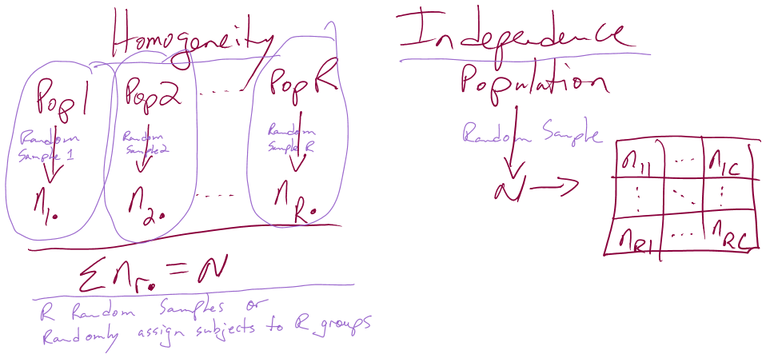

---
output:
  pdf_document: 
    keep_tex: yes
  html_document: default
header-includes:
- \usepackage{amsmath}
- \usepackage{color}
---

# Chi-square tests {#chapter5}

```{r echo=F,warning=F,message=F}
set.seed(3234)
library(pander)
require(mosaic)
```


```{r echo=F}
#Color Format
colFmt = function(x, color){
  outputFormat = opts_knit$get("rmarkdown.pandoc.to")
  if(outputFormat == 'latex')
    paste("\\textcolor{",color,"}{",x,"}",sep="")
  else if(outputFormat == 'html')
    paste("<font color='",color,"'>",x,"</font>",sep="")
  else
    x
}
```

## Situation, contingency tables, and plots	{#section5-1}

In this chapter, the focus shifts briefly from analyzing quantitative 
response variables to methods
for handling categorical response variables. This is important because in some
situations it is not possible to measure the response variable quantitatively. 
For example, we will analyze the results from a clinical trial where the results
for the subjects were measured as one of three categories: *no improvement*, 
*some improvement*, and *marked improvement*. While that type of response 
could be treated as
numerical, coded possibly as 1, 2, and 3, it would be difficult to assume that
the responses such as those follow a normal distribution since they are 
***discrete*** (not continuous, measured at whole number values only) and, 
more importantly, 
the difference between *no improvement* and *some improvement* is not 
necessarily the same as the difference between *some* and *marked improvement*. 
If it is treated numerically, then the differences are assumed to be the same
unless a different coding scheme is used (say 1, 2, and 5). It is better to
treat these types of responses as being in one of the three categories and use
statistical methods that don't make unreasonable assumptions about what the
numerical coding might mean. The study being performed here involved subjects
randomly assigned to either a treatment or a placebo (control) group and we
want to address research questions similar to those considered in 
Chapters \@ref(chapter2) and \@ref(chapter3) --
assessing differences among two or more groups. With quantitative
responses, the differences in the distributions are parameterized via the means
of the groups and we used 2-sample mean or ANOVA hypotheses and tests. With
categorical responses, the focus is on the probabilities of getting responses in
each category and whether they differ among the groups. 

We start with some useful summary techniques, both numerical and graphical, 
applied to some examples of
studies these methods can be used to analyze. Graphical techniques provide
opportunities for assessing specific patterns in variables, relationships
between variables, and for generally understanding the responses obtained. 
There are many different types of plots and each can enhance certain features
of data. We will start with a "fun" display, called a tableplot, to help us
understand some aspects of the results from a double-blind randomized clinical
trial investigating a treatment for rheumatoid arthritis that has the
categorical response variable introduced previously. These data are available
in the ``Arthritis`` data set available in the ``vcd`` package (Meyer, Zeileis, 
and Hornik, 2015). There were $n=84$ subjects, with some demographic 
information recorded
along with the ``Treatment`` status (*Treated*, *Placebo*) and whether the 
patients' arthritis symptoms ``Improved`` (with levels of *None*, *Some*, 
and *Marked*). 

The ``tableplot`` function from the ``tabplot`` package (Tennekes and de 
Jonge, 2016) displays bars for each response in a row^[In larger data sets, 
multiple subjects are displayed in each row as proportions of
the rows in each category.] based on the 
category of responses or as a bar with the height corresponding
the value of quantitative variables. It also plots a red cell if the
observations were missing on a particular variable. The plot can be obtained
simply as ``tableplot(DATASETNAME)``. But when using ``tableplot``, we may 
not want to display everything in the data.frame and often just select some 
of the variables. We use ``Treatment``, ``Improved``, ``Sex``, and ``Age``
in the ``select=...`` option with a ``c()`` and commas between the names of 
the variables we want to display. The first one in the list is also the one that
the data are sorted based on. 

(ref:fig5-1) Table plot of the arthritis data set.

```{r Figure5-1,fig.cap="(ref:fig5-1)",warning=F,message=FALSE}
require(vcd)
data(Arthritis) #Double-blind clinical trial with treatment and control groups
#Homogeneity example
require(tabplot)
tableplot(Arthritis,select=c(Treatment,Improved,Sex,Age))
```

The first thing we can gather from Figure \@ref(fig:Figure5-1) is that there 
are no red cells so there were no missing
observations in the data set. Missing observations regularly arise in real
studies when observations are not obtained for many different reasons and it is
always good to check for missing data issues -- this plot provides a quick visual
method for doing that check. Primarily we are interested in whether the
treatment led to a different pattern (or rates) of improvement responses. There
seems to be more purple (*Marked*) improvement responses in the treatment 
group and more blue (*None*) responses in the placebo group. 
This sort of plot also helps us to simultaneously consider the role of other
variables in the observed responses. You can see the sex of each subject in the
vertical panel for ``Sex`` and it seems
that there is a relatively reasonable mix of males and females in the
treatment/placebo groups. Quantitative variables are also displayed with
horizontal bars corresponding to the responses. From the panel for 
``Age``, we can see that the ages of subjects ranged from the 20s to 70s 
and that there is no clear difference in
the ages between the treated and placebo groups. If, for example, all the male
subjects had ended up being randomized into the treatment group, then we might
have worried about whether sex and treatment were confounded and whether any
differences in the responses might be due to sex instead of the treatment. The
random assignment of treatment/placebo to the subjects appears to have been
successful here with the ages and sexes appearing to be well-mixed among the
two treatment groups. The main benefit of this sort of plot is the ability to
visualize more than two categorical variables simultaneously. But now we want
to focus more directly on the researchers' main question -- does the treatment
lead to different improvement outcomes than the placebo?

To directly assess the effects of the treatment, we
want to display just the two variables of interest. ***Stacked bar charts***
provide a method of displaying the response patterns (in ``Improved``) across 
the levels of a predictor variable(``Treatment``) by displaying a bar for each
predictor variable level and the proportions of responses in each category of
the response in each of those groups. If the placebo is as effective as the
treatment, then we would expect similar proportions of responses in each
improvement category. A difference in the effectiveness would manifest in
different proportions in the different improvement categories between *Treated* 
and *Placebo*. To get information in this direction, we start with
obtaining the counts in each combination of categories using the ``tally``
function to generate contingency tables. ***Contingency tables*** with 
***R*** rows and ***C*** columns (called ***R by C tables***) summarize 
the counts of observations in each combination of the explanatory and 
response variables. In these data, there are $R=2$ rows and $C=3$ columns 
making a $2\times 3$ table -- note that you do not count the row
and column for the "Totals" in defining the size of the table. In the table, 
there seems to be many more *Marked* improvement responses (21 vs 7) and 
fewer *None* responses (13 vs 29) in the treated group compared to the 
placebo group. 

```{r}
require(mosaic)
tally(~Treatment+Improved, data=Arthritis, margins=T)
```

Using the ``tally`` function with ``~x+y`` provides a contingency table with
the ``x`` variable on the rows and the ``y`` variable on the columns, with
``margins=T`` as an option so we can obtain the totals along the rows, 
columns, and table total of $N=84$. In general, contingency tables contain 
the counts $n_{rc}$ in the $r^{th}$ row and $c^{th}$ column where
$r=1,\ldots,R$ and $c=1,\ldots,C$. We can also define the ***row totals***
as the sum across row $r$ as

$$\mathbf{n_{r\bullet}}=\Sigma^C_{c=1}n_{rc},$$
the ***column totals*** as the sum across column $c$ as

$$\mathbf{n_{\bullet c}}=\Sigma^R_{r=1}n_{rc},$$

and the ***table total*** as

$$\mathbf{N}=\Sigma^R_{r=1}\mathbf{n_{r\bullet}} = \Sigma^C_{c=1}\mathbf{n_{\bullet c}}
= \Sigma^R_{r=1}\Sigma^C_{c=1}\mathbf{n_{rc}}.$$

We'll need these quantities to do some calculations in a bit. A generic 
contingency table with added row, column, 
and table totals just like the previous result from the ``tally``
function is provided in Table \@ref(tab:Table5-1).

(ref:tab5-1) General notation for counts in an R by C contingency table.

```{r Table5-1, echo=F}
columnHeaders <- c("$\\textbf{Response}\\\\\\textbf{Level }1$", 
                   "$\\textbf{Response}\\\\\\textbf{Level }2$",
                   "$\\textbf{Response}\\\\\\textbf{Level }3$",
                   "$\\mathbf{\\ldots}\\\\$",
                   "$\\textbf{Response}\\\\\\textbf{Level }C$",
                   "$\\textbf{Totals}$")
rowLabels <- c("**Group 1**","**Group 2**","$\\mathbf{\\ldots}$","**Group R**","**Totals**")
row1 <- c("$n_{11}$","$n_{12}$","$n_{13}$","$\\ldots$","$n_{1C}$","$\\mathbf{n_{1\\bullet}}$")
row2 <- c("$n_{21}$","$n_{22}$","$n_{23}$","$\\ldots$","$n_{2C}$","$\\mathbf{n_{2\\bullet}}$")
row3 <- c("$\\ldots$","$\\ldots$","$\\ldots$","$\\ldots$","$\\ldots$","$\\mathbf{\\ldots}$")
rowR <- c("$n_{R1}$","$n_{R2}$","$n_{R3}$","$\\ldots$","$n_{RC}$","$\\mathbf{n_{R\\bullet}}$")
rowT <- c("$\\mathbf{n_{\\bullet 1}}$","$\\mathbf{n_{\\bullet 2}}$","$\\mathbf{n_{\\bullet 3}}$",
          "$\\mathbf{\\ldots}$","$\\mathbf{n_{\\bullet C}}$","$\\mathbf{N}$")
x <- matrix(c(row1,row2,row3,rowR,rowT),ncol=6,byrow = T,
            dimnames = list(rowLabels,columnHeaders))

kable(x,caption="(ref:tab5-1)")
```

Comparing counts from the contingency table is useful, but comparing proportions
in each category is better, especially when the sample sizes in the levels of 
the explanatory variable differ. Switching the formula used in the ``tally ``
function formula to ``~ y | x`` and adding the ``format="proportion"``
option provides the proportions in the response categories conditional on the 
category of the predictor (these are
called ***conditional proportions*** or the ***conditional distribution*** of, 
here, *Improved* on *Treatment*)^[The vertical line, "``|`` ", in ``~ y|x``
is available on most keyboards on the same key as "\". It is the mathematical 
symbol that means "conditional on" whatever follows.]. 
Note that they sum to 1.0 in each level of x, *placebo* or *treated*:

```{r}
tally(~Improved|Treatment, data=Arthritis, format="proportion", margins=T)
```

Note that it switches the variables between the rows and columns from the 
first summary of the data but the single
"Total" row makes it clear to read the proportions down the columns in this
version of the table. In this application, it shows how the proportions seem to
between the placebo and treatment groups. This matches the previous thoughts on
this data set, but now a difference of marked improvement of 16% vs 51% is more
clearly a big difference. We can also display this result using a 
***stacked bar-chart*** that displays the same information, using the ``plot``
function with a ``y~x`` formula:

(ref:fig5-2) Stacked bar chart of Arthritis data. The left bar is for the Placebo group
and the right bar is for the Treated group. The width of the bars is based on
relative size of each group and the portion of the total height of each shaded
area is the proportion of that group in each category. The darkest shading is
for "none", medium shading for "some", and the lightest shading for "marked", 
as labeled on the y-axis.

```{r Figure5-2,fig.cap="(ref:fig5-2)"}
plot(Improved~Treatment, data=Arthritis,
     main="Stacked Bar Chart of Arthritis Data")
```

The stacked bar-chart in Figure \@ref(fig:Figure5-2) displays the previous 
conditional proportions for the groups, with
the same relatively clear difference between the groups persisting. If you run
the ``plot`` function with variables that are
coded numerically, it will make a very different looking graph (R is smart!) so
again be careful that you are instructing R to treat your variables as
categorical if they really are categorical. R is powerful but can't read your
mind!

In this chapter, we analyze data collected in two different fashions and 
modify the hypotheses to
reflect the differences in the data collection processes, choosing either
between what are called Homogeneity and Independence tests. The previous
situation where levels of a treatment are randomly assigned to the subjects in
a study describes the situation for what is called a ***Homogeneity Test***.
Homogeneity also applies when random samples are taken from each population of
interest to generate the observations in each group of the explanatory variable. 
These sorts of situations resemble many of the examples from 
Chapter \@ref(chapter3) where treatments were assigned to subjects. The other 
situation considered is where a
single sample is collected to represent a population and then a contingency
table is formed based on responses on two categorical variables. When one
sample is collected and analyzed using a contingency table, the appropriate
analysis is called an ***Independence*** or ***Association test***. In this
situation, it is not necesssary to have variables that are clearly classified
as explanatory or response although it is certainly possible. Data that often 
align with Independence testing are collected using surveys of
subjects randomly selected from a single, large population. An example, 
analyzed below, involves a survey of voters and whether their party affiliation
is related to who they voted for -- the republican, democrat, or other
candidate. There is clearly an explanatory variable of the *Party affiliation*
but a single large sample was taken from the population of all likely voters 
so the Independence test needs to be applied. 
Another example where Independence is appropriate involves a study of student
cheating behavior. Again, a single sample was taken from the population of
students at a university and this determines that it will be an Independence
test. Students responded to questions about lying to get out of turning in a
paper and/or taking an exam (*none*, *either*, or *both*) and copying on an 
exam and/or turning in a paper written by
someone else (*neither*, *either*, or *both*). In this situation, it is not 
clear which variable is the
response or explanatory (which should explain the other) and it does not matter
with the Independence testing framework. Figure \@ref(fig:Figure5-3) contains 
a diagram of the
data collection processes and can help you to identify the appropriate analysis
situation.

(ref:fig5-3) Diagram of the scenarios involved
in Homogeneity and Independence tests. Homogeneity testing involves R random
samples or subjects assigned to R groups. Independence testing involves a
single random sample and measurements on two categorical variables. 

```{r Figure5-3,fig.cap="(ref:fig5-3)",echo=F}

```

You will discover that the test statistics are the same for both methods, 
which can create some desire
to assume that the differences in the data collection doesn't matter. In
Homogeneity designs, the sample size in each group
$(\mathbf{n_{1\bullet}},\mathbf{n_{2\bullet},\ldots,\mathbf{n_{R\bullet}}})$
is fixed. In Independence situations, the total sample size $\mathbf{N}$ is
fixed but all the $\mathbf{n_{r\bullet}}\text{'s}$ are random. These
differences impact the graphs, hypotheses, and conclusions used even though
the test statistics and p-values are calculated the same way -- so we only
need to learn one test statistic to handle the two situations, but we need
to make sure we know which we're doing!

## Homogeneity Test Hypotheses	{#section5-2}

If we define some additional notation, we can then define hypotheses that allow us
to assess evidence related to whether the treatment "matters" in Homogeneity
situations. This situation is similar to what we did in the One-Way ANOVA
situation with quantitative responses in Chapter \@ref(chapter3) but the parameters now
relate to proportions in the response variable categories across the groups. 
First we can define the conditional population proportions in level $c$ (column 
$c=1,\ldots,C$) of group $r$ (row $r=1,\ldots,R$) as $p_{rc}$. 
Table \@ref(tab:Table5-2) shows the proportions, noting that the proportions 
in each row sum to 1 since they are conditional on the group of
interest. A ***transposed*** (rows and columns flipped) version of this table is
produced by the ``tally`` function if you use the formula ``~y|x``.

(ref:tab5-2) Table of conditional proportions in the Homogeneity testing scenario. 

```{r Table5-2,echo=F}
columnHeaders <- c("$\\textbf{Response}\\\\\\textbf{Level }1$", 
                   "$\\textbf{Response}\\\\\\textbf{Level }2$",
                   "$\\textbf{Response}\\\\\\textbf{Level }3$",
                   "$\\mathbf{\\ldots}\\\\$",
                   "$\\textbf{Response}\\\\\\textbf{Level }C$",
                   "$\\textbf{Totals}$")
rowLabels <- c("**Group 1**","**Group 2**","$\\mathbf{\\ldots}$","**Group R**")
row1 <- c("$p_{11}$","$p_{12}$","$p_{13}$","$\\ldots$","$p_{1C}$","$\\mathbf{1.0}$")
row2 <- c("$p_{21}$","$p_{22}$","$p_{23}$","$\\ldots$","$p_{2C}$","$\\mathbf{1.0}$")
row3 <- c("$\\ldots$","$\\ldots$","$\\ldots$","$\\ldots$","$\\ldots$","$\\mathbf{\\ldots}$")
rowR <- c("$p_{R1}$","$p_{R2}$","$p_{R3}$","$\\ldots$","$p_{RC}$","$\\mathbf{1.0}$")
x <- matrix(c(row1,row2,row3,rowR),ncol=6,byrow = T,
            dimnames = list(rowLabels,columnHeaders))
kable(x,caption="(ref:tab5-2)")
```

In the Homogeneity situation, the null hypothesis is that the distributions are the same in all
the $R$ populations. This means that the null hypothesis is:

$$\begin{align}
\mathbf{H_0:}\  & \mathbf{p_{11}=p_{21}=\ldots=p_{R1}} \textbf{ and } \mathbf{p_{12}=p_{22}=\ldots=p_{R2}}  \textbf{ and } \mathbf{p_{13}=p_{23}=\ldots=p_{R3}} \\ 
& \textbf{ and } \mathbf{\ldots} \textbf{ and }\mathbf{p_{1C}=p_{2C}=\ldots=p_{RC}}. \\
\end{align}$$

If all the groups are the same, then they all have the same conditional proportions and we can 
more simply write the null hypothesis as:

$$\mathbf{H_0:(p_{r1},p_{r2},\ldots,p_{rC})=(p_1,p_2,\ldots,p_C)} \textbf{ for all } \mathbf{r}.$$

In other words, the pattern of proportions across the columns are **the same for all the**
$\mathbf{R}$ **groups**. The alternative is that there is some difference in the proportions 
of at least one
response category for at least one group. In slightly more gentle and easier to
reproduce words, equivalently, we can say:

* $\mathbf{H_0:}$ **The population distributions of the responses for variable** $\mathbf{y}$
**are the same across the** $\mathbf{R}$ **groups**.

The alternative hypothesis is then:

* $\mathbf{H_A:}$ **The population distributions of the responses for variable** $\mathbf{y}$
**are NOT ALL the same across the** $\mathbf{R}$ **groups**.

To make this concrete, consider what the proportions could look like if they satisfied 
the null hypothesis for the *Arthritis* example, as displayed in Figure \@ref(fig:Figure5-4).

(ref:fig5-4) Plot of what the Arthritis proportions would look like if the null 
hypothesis had been true.

```{r Figure5-4,fig.cap="(ref:fig5-4)",echo=F,warning=F,message=F}
ArthritisFAKE <- rbind(Arthritis,Arthritis) # Just to make the following plot!
ArthritisFAKE$Treat<-factor(c(rep("Placebo",84),rep("Treated",84))) #Just to make the following plot
plot(Improved~Treat,data=ArthritisFAKE,main="Homogeneity Null Hypothesis True")
```

Note that the proportions in the different response categories do not need to be the 
same just that the distribution needs
to be the same across the groups. To make this clear, the null hypothesis does *not*
require that all three response categories (*none*, *some*, *marked*) be equally 
likely. It assumes
that whatever the distribution of proportions is across these three levels that
there is no difference in that distribution between the explanatory variable
(here treated/placebo) groups. Figure \@ref(fig:Figure5-4) shows an example of a 
situation where
the null hypothesis is true and the distributions of responses across the
groups look the same but the proportions for *none*, *some* and *marked* are 
not all equally likely. That
situation satisfies the null hypothesis. Compare this plot to the one for the
real data set in Figure \@ref(fig:Figure5-2). It looks like there might be 
some differences in
the responses between the treated and placebo groups as that plot looks much
different from this one, but we will need a test statistic and a p-value to
fully address the evidence relative to the previous null hypothesis. 

## Independence Test Hypotheses	{#section5-3}

## Models for R by C tables	{#section5-4}

## Permutation tests for the X2 statistic	{#section5-5}

## Chi-square distribution for the X2 statistic	{#section5-6}

## Examining residuals for the source of differences	{#section5-7}

## General Protocol for X2 tests	{#section5-8}

## Political Party and Voting results: Complete Analysis	{#section5-9}

## Is cheating and lying related in students?	{#section5-10}

## Analyzing a stratified random sample of California schools	{#section5-11}

## Chapter summary	{#section5-12}

## Review of Important R commands	{#section5-13}

## Practice problems	{#section5-14}

