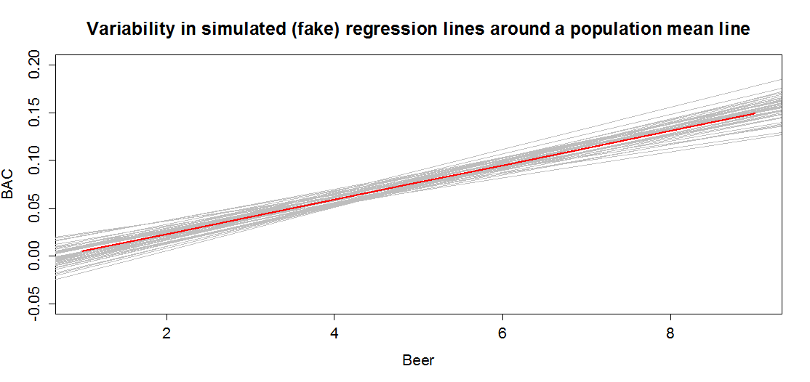

---
output:
  pdf_document: 
    keep_tex: yes
  html_document: default
header-includes:
- \usepackage{amsmath}
- \usepackage{color}
---

# Simple linear regression inference {#chapter7}

```{r echo=F,warning=F,message=F}
set.seed(5678)
library(pander)
require(mosaic)
library(knitr)
knitr::opts_chunk$set(cache = TRUE)
options(show.signif.stars = FALSE)
```


```{r echo=F}
#Color Format
colFmt = function(x, color){
  outputFormat = opts_knit$get("rmarkdown.pandoc.to")
  if(outputFormat == 'latex')
    paste("\\textcolor{",color,"}{",x,"}",sep="")
  else if(outputFormat == 'html')
    paste("<font color='",color,"'>",x,"</font>",sep="")
  else
    x
}
```


## Model	{#section7-1}

In Chapter \@ref(chapter6), we learned how to estimate and interpret 
correlations and regression
equations with a single predictor variable (***simple linear regression*** 
or SLR). We carefully explored the variety of things that could go wrong and
how to check for problems in regression situations. In this chapter, that work
provides the basis of performing statistical inference that mainly focuses on
the population slope coefficient based on the sample slope coefficient. As a
reminder, the estimated regression model is $\hat{y}_i = b_0 + b_1x_i$. the
population regression equation is $y_i = \beta_0 + \beta_1x_i + \epsilon_i$.
Where $\beta_0$ is the ***population*** (or true) ***y-intercept*** and
$\beta_1$ is the ***population*** (or true) ***slope coefficient***. 
These are population parameters (fixed but typically unknown). This model can
be re-written to think about different components and their roles. The mean of
a random variable is statistically denoted as $E(y_i)$, the
***expected value of*** $\mathbf{y_i}$, or as $\mu_{y_i}$ and the mean of the
response variable in a simple linear model is specified by 
$E(y_i) = \mu_{y_i} = \beta_0 + \beta_1x_i$. This uses the true regression line
to define the model for the mean of the responses as a function of the value of
the explanatory variable. 

The other part of any statistical model is specifying a model for the
variability around the mean. 
There are two aspects to the variability to specify here -- the shape of the
distribution and the spread of the distribution. This is where the 
normal distribution
and our "normality assumption" re-appears. And for normal distributions, we
need to define a variance parameter, $\sigma^2$. Combined, the complete 
regression model is

$$y_i \sim N(\mu_{y_i},\sigma^2), \text{ with } 
\mu_{y_i} = \beta_0 + \beta_1x_i,$$

which can be read as "y follows a normal distribution
with mean mu-y and variance sigma-squared". This also implies that the random
variability around the true mean, the errors, follow a normal distribution with
mean 0 and that same variance, $\epsilon_i \sim N(0,\sigma^2)$. The true 
deviations ($\epsilon_i$) are once again estimated by the
residuals, $e_i = y_i - \hat{y}_i$ = observed response -- predicted
response. We can use the residuals to estimate $\sigma$, which is also
called the ***residual standard error***, 
$\hat{\sigma} = \sqrt{\Sigma e^2_i / (n-2)}$. We will find this quantity 
near the end
of the regression output as discussed below so the formula is not heavily used
here. This provides us with the three parameters that are estimated as part of
our SLR model: $\beta_0, \beta_1,\text{ and } \sigma$.

These definitions also formalize the assumptions implicit in the 
regression model:

1. The errors follow a normal distribution (***Normality assumption***).

2. The errors have the same variance (***Constant variance assumption***).

3. The observations are independent (***Independence assumption***).

4. The model for the mean is "correct" (***Linearity, No Influential points,
Only one group***). 

The diagnostics described at the end of Chapter \@ref(chapter6) provide 
techniques for checking these assumptions -- meeting these
assumptions is fundamental to having a regression line that we trust and
inferences from it that we also can trust. 

To make this clearer, suppose that in the *Beers *and *BAC* study that 
they had randomly assigned 20 students to consume each number of beers.
We would expect some
variation in the *BAC* for each group of 20 at each level of *Beers* but 
that each group of observations will be centered at the true mean *BAC*
for each number of *Beers*. The regression model assumes that the *BAC* 
values are normally distributed around the mean for each *Beer* level,
$\text{BAC}_i \sim N(\beta_0 + \beta_1\text{ Beers}_i,\sigma^2)$, with
the mean defined by the regression equation. We actually do not need to 
obtain more than one observation at each $x$ value to
make this assumption or assess it, but the plots below show you what this could
look like. The sketch in Figure \@ref(fig:Figure7-1) attempts to show 
the idea of normal
distributions that are centered at the true regression line, all with the same
shape and variance that is an assumption of the regression model.

(ref:fig7-1) Sketch of assumed normal distributions for the responses 
centered at the regression line.

```{r Figure7-1,fig.cap="(ref:fig7-1)",echo=F,message=F,warning=F,fig.align='center'}
knitr::include_graphics("chapter7_files/image029.png")
```

Figure \@ref(fig:Figure7-2) contains simulated realizations from a normal
distribution of 20 subjects at each *Beer* level around the assumed true
regression line with two different residual SEs of 0.02 and 0.06. The original
BAC model has a residual SE of 0.02 but had many fewer observations at each 
*Beer* value.

(ref:fig7-2) Simulated data for Beers and BAC assuming two different residual
standard errors (0.02 and 0.06).

```{r Figure7-2,fig.cap="(ref:fig7-2)",echo=F,message=F,warning=F}
BB<- read.csv("http://www.math.montana.edu/courses/s217/documents/beersbac.csv")
m1<-lm(BAC~Beers,data=BB)
par(mfrow=c(1,1))
set.seed(3456)

coef1<-m1$coefficients
Beersnew<-sort(rep(1:9,20))


e1_20<-rnorm(n=length(Beersnew),0,sd=0.02)
e1_20<-e1_20-mean(e1_20)
y1_20<-coef1[1]+coef1[2]*Beersnew+e1_20
plot(y1_20~I(Beersnew-0.05),ylim=c(-.1,0.27),pch=16,ylab="Simulated BACs",xlab="Beers")
abline(coef1,col="khaki",lwd=2)
e2_20<-rnorm(n=length(Beersnew),mean=0,sd=0.06)
e2_20<-e2_20-mean(e2_20)
y2_20<-coef1[1]+coef1[2]*Beersnew+e2_20
points(y2_20~I(Beersnew+.05),ylim=c(0,0.25),pch=17,col="orange")

legend("topleft",c("Residual SE=0.02","Residual SE=0.06"),pch=c(16,17),col=c("black","orange"),cex=1.1)
```

Along with getting the idea that regression models define normal 
distributions in the y-direction that are
centered at the regression line, you can also get a sense of how variable
samples from a normal distribution can appear. Each distribution of 20 subjects
at each $x$ value came from a normal distribution but there are some of those
distributions that might appear to generate small outliers and have slightly
different variances. This can help us to remember to not be too particular when
assessing assumptions and allow for some variability in spreads and a few
observations from the tails of the distribution to occasionally arise. 

In sampling from the population, we expect some amount of variability 
of each estimator around its
true value. This variability leads to the potential variability in estimated
regression lines (think of a suite of potential estimated regression lines that
would be created by different random samples from the same population). 
Figure \@ref(fig:Figure7-3) contains the true regression line (bold, red)
and realizations of the
estimated regression line in simulated data based on results similar to the
real data set. 

(ref:fig7-3) Variability in realized regression lines based on sampling 
variation. 

```{r Figure7-3,fig.cap="(ref:fig7-3)",echo=F,warning=F,message=F}

```

This variability due to random sampling is something that needs to be
properly accounted for to take the **single** estimated regression line to
make inferences about the true line and parameters based on the sample-based
estimates. The next sections develop those inferential tools. 

## Confidence Interval and Hypothesis tests for the slope and intercept	{#section7-2}

## Bozeman temperature trend	{#section7-3}

## Randomizing inferences for the slope coefficient	{#section7-4}

## Transformations part I: Linearizing relationships	{#section7-5}

## Transformations part II: Impacts on SLR interpretations: log(y), log(x), & both log(y) & log(x)	{#section7-6}

## Confidence Interval for the mean and prediction Intervals for a new observation	270

## Chapter summary	{#section7-7}

## Important R code {#section7-8}

## Practice problems	{#section7-9}

