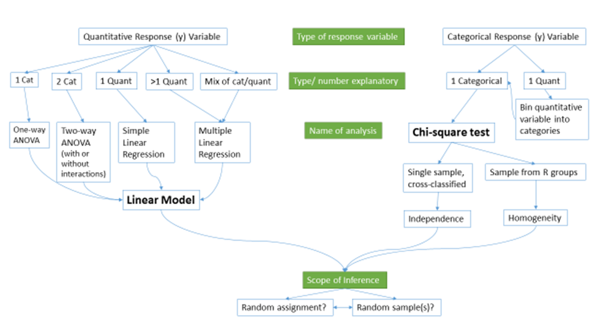

---
output:
  pdf_document: 
    keep_tex: yes
  html_document: default
header-includes:
- \usepackage{amsmath}
- \usepackage{color}
---

# Case studies {#chapter9}

```{r echo=F,warning=F,message=F}
set.seed(3234)
library(pander)
require(mosaic)
library(knitr)
knitr::opts_chunk$set(cache = TRUE)
options(show.signif.stars = FALSE)
```


```{r echo=F}
#Color Format
colFmt = function(x, color){
  outputFormat = opts_knit$get("rmarkdown.pandoc.to")
  if(outputFormat == 'latex')
    paste("\\textcolor{",color,"}{",x,"}",sep="")
  else if(outputFormat == 'html')
    paste("<font color='",color,"'>",x,"</font>",sep="")
  else
    x
}
```


## Overview of material covered	{#section9-1}

At the beginning of the text, we provided a schematic of methods that you would
learn about that was (probably) gibberish. Hopefully, revisiting that same diagram
(Figure \@ref(fig:Figure9-1) will bring back memories of each of the chapters.
Categorical variables create special challenges whether they are explanatory or
response variables. 

(ref:fig9-1) Schematic of methods covered. 

```{r Figure9-1,fig.cap="(ref:fig9-1)",echo=F,warning=F,message=F}

```

Every scenario with a quantitative response variable was handled using linear
models. The last material on multiple linear regression modeling tied back to
the One and Two-Way ANOVA models as categorical variables were added to the
models. As both a review and to emphasize the connections, let's connect some 
of the different versions of the general linear model that we considered. 

If we start with the One-Way ANOVA, the referenced-coded model was written out
as:

$$y_{ij}=\alpha + \tau_j + \varepsilon_{ij}.$$

We didn't want to introduce indicator variables at that early stage of the 
material, but we can now write out the same model using our indicator variable
approach from Chapter \@ref(chapter8) for a $J$-level categorical explanatory
variable using $J-1$ indicator variables as:

$$y_i = \beta_0 + \beta_1I_{\text{Level }2,i} + \beta_2I_{\text{Level }3,i} +
\cdots + \beta_{J-1}I_{\text{Level }J,i} + \varepsilon_i.$$

We now know how the indicator variables are either 0 or 1 for each observation
and only one takes in the value 1 (is "turned on") at a time for each response.
We can then equate the general notation from Chapter \@ref(chapter8) with our
specific One-Way ANOVA (Chapter \@ref(chapter3)) notation as follows:

* $\alpha = \beta_0$:

    * The mean for the baseline category was modeled using $\alpha$ which is
    the intercept term in the output that we called $\beta_0$ in the
    regression models. 
    
* For category $j$:

    * From the One-Way ANOVA model:
    
        * $\alpha + \tau_j$
        
    * From the regression model where the only indicator variable that is 1
    is $I_{\text{Level }j,i}$:
    
        * $\beta_0 + \beta_1I_{\text{Level }2,i} + \beta_2I_{\text{Level }3,i} + \cdots + \beta_JI_{\text{Level }J,i} =  \beta_0 + \beta_{j-1}*1$
        
        * $= \beta_0 + \beta_{j-1}$
        
    * So with intercepts being equal, $\beta_{j-1}=\tau_j$.

The ANOVA reference-coding notation was used to focus on the coefficients that
were "turned on" and their interpretation without getting bogged down in the
full power (and notation) of general linear models. The same equivalence is 
possible to equate our work in the Two-Way ANOVA interaction model, 

$$y_{ijk} = \alpha + \tau_j + \gamma_k + \omega_{jk} + \varepsilon_{ijk},$$

with the regression notation from the MLR model with an interaction: 

$$\begin{array}{rc}
y_i=&\beta_0 + \beta_1x_i +\beta_2I_{\text{Level }2,i}+\beta_3I_{\text{Level }3,i}
+\cdots+\beta_JI_{\text{Level }J,i} +\beta_{J+1}I_{\text{Level }2,i}\:x_i \\
&+\beta_{J+2}I_{\text{Level }3,i}\:x_i
+\cdots+\beta_{2J-1}I_{\text{Level }J,i}\:x_i +\varepsilon_i
\end{array}$$

If one of the categorical variables only had two levels, then we could simply
replace $x_i$ with the pertinent indicator variable and be able to equate the
two versions of the notation. That said, we won't attempt that here. And if
both variables have more than 2 levels, the number of coefficients to keep 
track of grows rapidly. The great increase in complexity of notation to fully 
writing out the indicator variables in the regression approach with 
interactions with two categorical variables is the other reason we explored the
Two-Way ANOVA using a "simplified" notation system even though ``lm`` used the
indicator approach to fit the model. The Two-Way ANOVA notation helped us 
distinguish which coefficients related to main effects and the interaction, 
something that the regression notation doesn't make clear. 

In the following three sections, you will have one more chance to see
applications of the methods considered here. The data sets are taken directly 
from published research articles, so you can see the potential utility of the
methods we've been discussing for handling real problems. They are focused on
biological applications because the particular journal (*Biology Letters*) that
all of these were drawn from encourages authors to share their data sets, making
our re-analyses possible. Use these sections to review or to re-inforce methods 
from earlier in the book.

## The impact of simulated chronic nitrogen deposition on the biomass and N2-fixation activity of two boreal feather moss–cyanobacteria associations	{#section9-2}

## Ants learn to rely on more informative attributes during decision-making	{#section9-3}

## Multi-variate models are essential for understanding vertebrate diversification in deep time	{#section9-4}

## General summary	{#section9-5}


