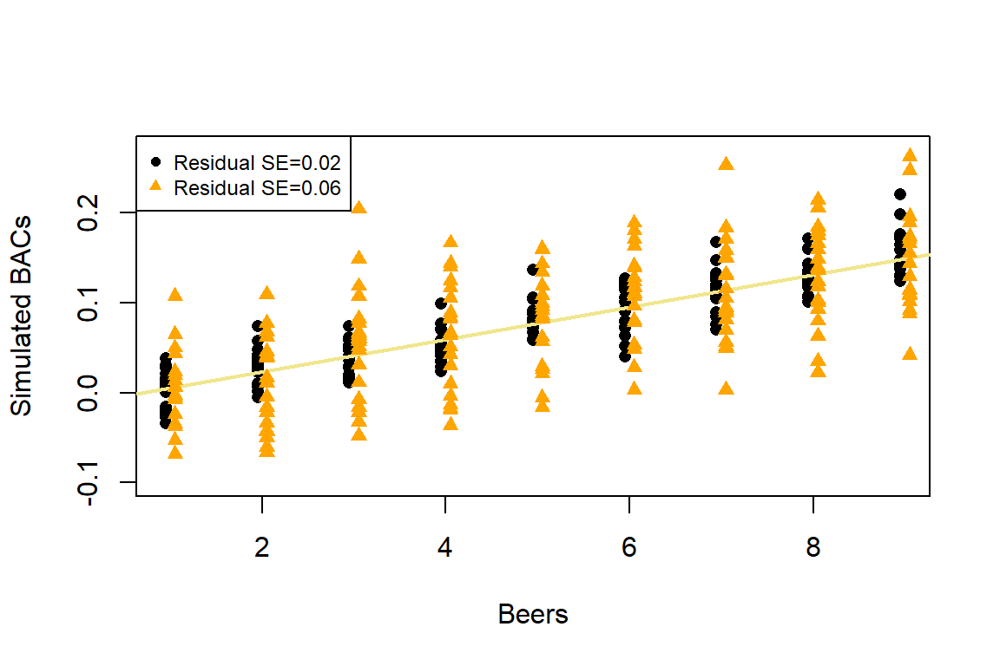
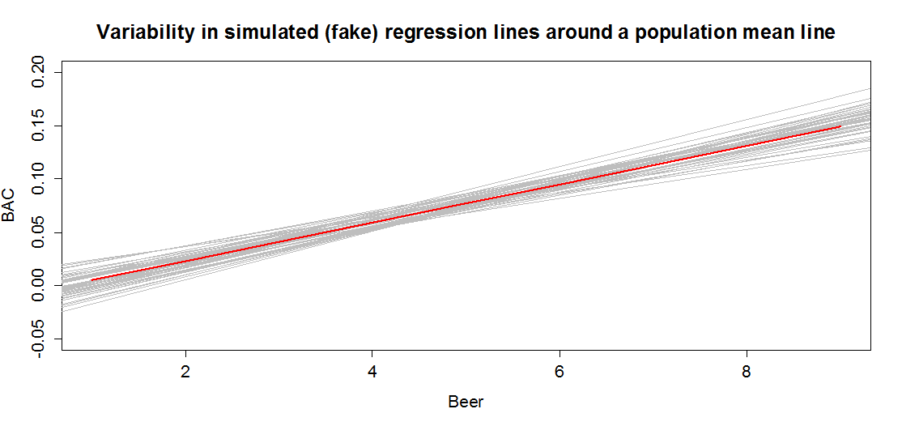
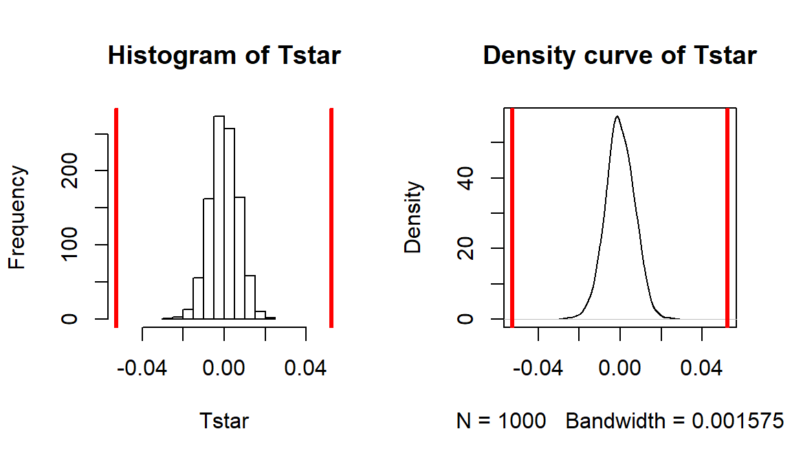
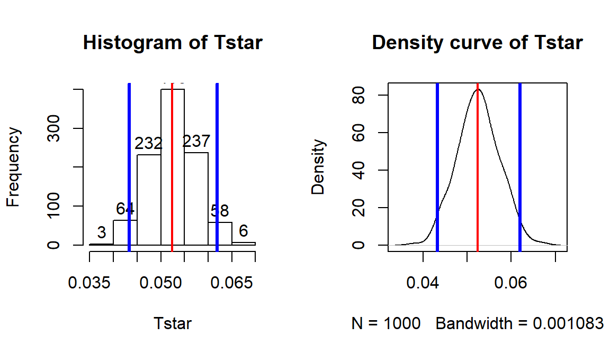
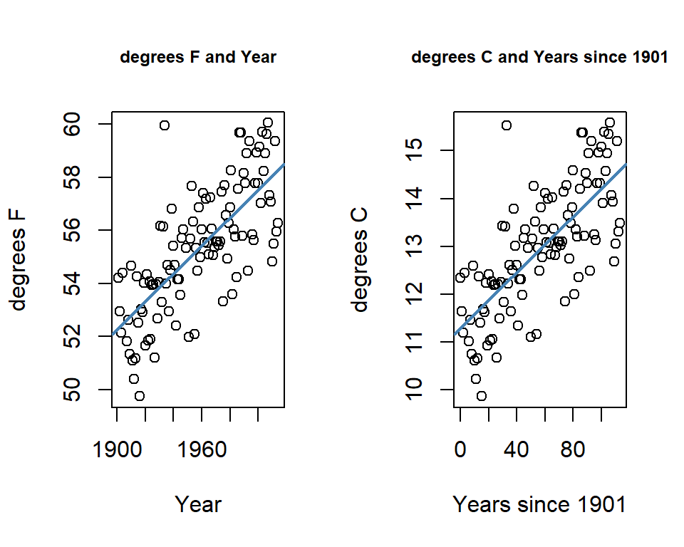

---
output:
  pdf_document: 
    keep_tex: yes
  html_document: default
header-includes:
- \usepackage{amsmath}
- \usepackage{color}
---

# Simple linear regression inference {#chapter7}


## Model	{#section7-1}

In Chapter \@ref(chapter6), we learned how to estimate and interpret 
correlations and regression
equations with a single predictor variable (***simple linear regression*** 
or SLR). We carefully explored the variety of things that could go wrong and
how to check for problems in regression situations. In this chapter, that work
provides the basis of performing statistical inference that mainly focuses on
the population slope coefficient based on the sample slope coefficient. As a
reminder, the estimated regression model is $\hat{y}_i = b_0 + b_1x_i$. the
population regression equation is $y_i = \beta_0 + \beta_1x_i + \epsilon_i$.
Where $\beta_0$ is the ***population*** (or true) ***y-intercept*** and
$\beta_1$ is the ***population*** (or true) ***slope coefficient***. 
These are population parameters (fixed but typically unknown). This model can
be re-written to think about different components and their roles. The mean of
a random variable is statistically denoted as $E(y_i)$, the
***expected value of*** $\mathbf{y_i}$, or as $\mu_{y_i}$ and the mean of the
response variable in a simple linear model is specified by 
$E(y_i) = \mu_{y_i} = \beta_0 + \beta_1x_i$. This uses the true regression line
to define the model for the mean of the responses as a function of the value of
the explanatory variable. 

The other part of any statistical model is specifying a model for the
variability around the mean. 
There are two aspects to the variability to specify here -- the shape of the
distribution and the spread of the distribution. This is where the 
normal distribution
and our "normality assumption" re-appears. And for normal distributions, we
need to define a variance parameter, $\sigma^2$. Combined, the complete 
regression model is

$$y_i \sim N(\mu_{y_i},\sigma^2), \text{ with } 
\mu_{y_i} = \beta_0 + \beta_1x_i,$$

which can be read as "y follows a normal distribution
with mean mu-y and variance sigma-squared". This also implies that the random
variability around the true mean, the errors, follow a normal distribution with
mean 0 and that same variance, $\epsilon_i \sim N(0,\sigma^2)$. The true 
deviations ($\epsilon_i$) are once again estimated by the
residuals, $e_i = y_i - \hat{y}_i$ = observed response -- predicted
response. We can use the residuals to estimate $\sigma$, which is also
called the ***residual standard error***, 
$\hat{\sigma} = \sqrt{\Sigma e^2_i / (n-2)}$. We will find this quantity 
near the end
of the regression output as discussed below so the formula is not heavily used
here. This provides us with the three parameters that are estimated as part of
our SLR model: $\beta_0, \beta_1,\text{ and } \sigma$.

These definitions also formalize the assumptions implicit in the 
regression model:

1. The errors follow a normal distribution (***Normality assumption***).

2. The errors have the same variance (***Constant variance assumption***).

3. The observations are independent (***Independence assumption***).

4. The model for the mean is "correct" (***Linearity, No Influential points,
Only one group***). 

The diagnostics described at the end of Chapter \@ref(chapter6) provide 
techniques for checking these assumptions -- meeting these
assumptions is fundamental to having a regression line that we trust and
inferences from it that we also can trust. 

To make this clearer, suppose that in the *Beers *and *BAC* study that 
they had randomly assigned 20 students to consume each number of beers.
We would expect some
variation in the *BAC* for each group of 20 at each level of *Beers* but 
that each group of observations will be centered at the true mean *BAC*
for each number of *Beers*. The regression model assumes that the *BAC* 
values are normally distributed around the mean for each *Beer* level,
$\text{BAC}_i \sim N(\beta_0 + \beta_1\text{ Beers}_i,\sigma^2)$, with
the mean defined by the regression equation. We actually do not need to 
obtain more than one observation at each $x$ value to
make this assumption or assess it, but the plots below show you what this could
look like. The sketch in Figure \@ref(fig:Figure7-1) attempts to show 
the idea of normal
distributions that are centered at the true regression line, all with the same
shape and variance that is an assumption of the regression model.

(ref:fig7-1) Sketch of assumed normal distributions for the responses 
centered at the regression line.

<div class="figure" style="text-align: center">

<p class="caption">(\#fig:Figure7-1)(ref:fig7-1)</p>
</div>

Figure \@ref(fig:Figure7-2) contains simulated realizations from a normal
distribution of 20 subjects at each *Beer* level around the assumed true
regression line with two different residual SEs of 0.02 and 0.06. The original
BAC model has a residual SE of 0.02 but had many fewer observations at each 
*Beer* value.

(ref:fig7-2) Simulated data for Beers and BAC assuming two different residual
standard errors (0.02 and 0.06).

<div class="figure">

<p class="caption">(\#fig:Figure7-2)(ref:fig7-2)</p>
</div>

Along with getting the idea that regression models define normal 
distributions in the y-direction that are
centered at the regression line, you can also get a sense of how variable
samples from a normal distribution can appear. Each distribution of 20 subjects
at each $x$ value came from a normal distribution but there are some of those
distributions that might appear to generate small outliers and have slightly
different variances. This can help us to remember to not be too particular when
assessing assumptions and allow for some variability in spreads and a few
observations from the tails of the distribution to occasionally arise. 

In sampling from the population, we expect some amount of variability 
of each estimator around its
true value. This variability leads to the potential variability in estimated
regression lines (think of a suite of potential estimated regression lines that
would be created by different random samples from the same population). 
Figure \@ref(fig:Figure7-3) contains the true regression line (bold, red)
and realizations of the
estimated regression line in simulated data based on results similar to the
real data set. 

(ref:fig7-3) Variability in realized regression lines based on sampling 
variation. 

<div class="figure">

<p class="caption">(\#fig:Figure7-3)(ref:fig7-3)</p>
</div>

This variability due to random sampling is something that needs to be
properly accounted for to take the **single** estimated regression line to
make inferences about the true line and parameters based on the sample-based
estimates. The next sections develop those inferential tools. 

## Confidence Interval and Hypothesis tests for the slope and intercept	{#section7-2}

Our inference techniques will resemble previous material with an 
interest in forming confidence intervals and
doing hypothesis testing, although the interpretation of confidence intervals
for slope coefficients take some extra care. Remember that the general form of
any parametric confidence interval is 

$$\text{estimate} \mp t^*\text{SE}_{estimate},$$

so we need to obtain the appropriate standard error for regression model
coefficients and the degrees of freedom to define the $t$-distribution
to look up $t^*$. We will find the $\text{SE}_{b_0}$ and $\text{SE}_{b_1}$
in the model summary. The degrees of freedom for the $t$-distribution
in simple linear regression are $\mathbf{df=n-2}$. Putting this 
together, the confidence interval for the true y-intercept, $\beta_0$, is
$\mathbf{b_0 \mp t^*_{n-2}}\textbf{SE}_{\mathbf{b_0}}$ although this 
confidence interval is rarely of interest. The confidence interval 
that is almost always of interest is for the true slope coefficient,
$\beta_1$, that is $\mathbf{b_1 \mp t^*_{n-2}}\textbf{SE}_{\mathbf{b_1}}$.
The slope confidence interval is used to do two
things: (1) inference for the amount of change in the mean of $y$ for a unit
change in $x$ in the population and (2) to potentially do hypothesis testing by
checking whether 0 is in the CI or not. The sketch in Figure \@ref(fig:Figure7-3b)
illustrates the roles of the
CI for the slope in terms of determining where the population slope coefficient
might be -- centered at the sample slope coefficient -- our best guess for the
true slope. This sketch informs an ***interpretation of the slope coefficient
confidence interval***: 

(ref:fig7-3b) Sketch of the role of the CI for slope in terms of determining
where the population slope coefficient might be.

<div class="figure" style="text-align: center">

<p class="caption">(\#fig:Figure7-3b)(ref:fig7-3b)</p>
</div>

> For a 1 ***[units of X]*** increase in **X**, we are ___ % confident 
  that the **true change in the mean of** ***Y*** will be between **LL**
  and **UL** ***[units of Y]***.
>

In this interpretation, LL and UL are the calculated lower and upper 
limits of the confidence interval. This builds
on our previous interpretation of the slope coefficient, adding in the
information about pinning down the true change (population change) in the mean
of the response variable. The interpretation of the y-intercept CI is: 

> For an ***x***  of 0 ***[units of X]***, we are 95% confident that
  the true mean of ***Y*** will be between **LL** and **UL**
  ***[units of Y]***.
>

This is really only interesting if we'll see a method for generating CIs
for the true mean at potentially more interesting values of $x$ in 
Section \@ref(section7-7). To trust the results from these
confidence intervals, all the regression validity conditions need to be met (or
at least close to met). 

The only hypothesis test of interest in this situation is for the slope
coefficient. To develop the hypotheses of interest in SLR, note the effect 
of having $\beta_1=0$ in the mean of the regression equation,
$\mu_{y_i} = \beta_0 + \beta_1x_i = \beta_0 + 0x_i = \beta_0$.
This is the "intercept-only" or "mean-only" model that suggests that 
the mean of $y$ does not vary with different values of $x$ as it is always
$\beta_0$. We saw this model in the ANOVA material as the reduced model when the
null hypothesis of no difference in the true means across the groups was true. 
Here, this is the same as saying that there is no linear relationship between $x$
and $y$, or that $x$ is of no use in predicting $y$, or that we make the same
prediction for $y$ for every value of $x$. Thus

$$\boldsymbol{H_0: \beta_1=0}$$

is a test for **no linear relationship between** $\mathbf{x}$ **and** $\mathbf{y}$
**in the population**. The alternative of $\boldsymbol{H_A: \beta_1\ne 0}$
that there is **some** linear relationship between $x$ and $y$ in the population,
is our main test of interest in these situations. It is also possible to test
greater than or less than alternatives in certain situations. 

Test statistics for regression coefficients are developed, if assumptions 
are met, using the $t$-distribution with $n-2$ degrees of freedom. The 
$t$-test statistic is generally

$$t=\frac{b_i}{\text{SE}_{b_i}}$$

with the main interest in the test for $\beta_1$ based on $b_1$ for now.
The p-value would be calculated using the two-tailed area from the 
$t_{n-2}$ distribution calculated using the ``pt`` function. The p-value 
to test these hypotheses is also provided
in the model summary as we will see below. 

The greater than or
less than alternatives can have interesting interpretations in certain
situations. For example, the greater than alternative 
$\left(\boldsymbol{H_A: \beta_1 > 0}\right)$ tests an alternative of a
positive linear relationship, with the p-value extracted just from the 
right tail of the same $t$-distribution. This could be
used when a researcher would only find a result "interesting" if a positive
relationship is detected, such as in the study of tree height and tree diameter
where a researcher might be justified in deciding to test only for a positive
linear relationship. Similarly, the left-tailed alternative is also possible,
$\boldsymbol{H_A: \beta_1 < 0}$. To get one-tailed p-values from two-tailed
results (the default), first check that the observed test statistic is
in the direction of the alternative ($t>0$ for $H_A:\beta_1>0$ or $t<0$
for $H_A:\beta_1<0$). **If these conditions are met, then the p-value for 
the one-sided test from the two-sided version is found by dividing the
reported p-value by 2**. If $t>0$ for $H_A:\beta_1>0$ or $t<0$
for $H_A:\beta_1<0$ are not met, then the p-value would be greater than
0.5 and it would be easiest to look it up directly using ``pt``.

We can revisit a couple of examples for a last time with these ideas in 
hand to complete the analyses. 

* For the *Beers, BAC* data, the 95% confidence for the true slope
  coefficient, $\beta_1$, is
  
  $$\begin{array}
  \boldsymbol{b_1 \mp t^*_{n-2}} \textbf{SE}_{\boldsymbol{b_1}}
  & \boldsymbol{= 0.01796 \mp 2.144787 * 0.002402} \\
  & \boldsymbol{= 0.01796 \mp 0.00515} \\
  & \boldsymbol{\rightarrow (0.0128, 0.0231).}
  \end{array}$$

You can find the components of this
calculation in the model summary and from ``qt(0.975, df=n-2)`` which was 
2.145 for the $t^*$-multiplier. Be careful not to use the $t$-value of 
7.48 in the model summary to
make confidence intervals -- that is the test statistic used below. The related
calculations are shown at the bottom of the following code:


```r
m1 <- lm(BAC~Beers, data=BB)
summary(m1)
```

```
## 
## Call:
## lm(formula = BAC ~ Beers, data = BB)
## 
## Residuals:
##       Min        1Q    Median        3Q       Max 
## -0.027118 -0.017350  0.001773  0.008623  0.041027 
## 
## Coefficients:
##              Estimate Std. Error t value Pr(>|t|)
## (Intercept) -0.012701   0.012638  -1.005    0.332
## Beers        0.017964   0.002402   7.480 2.97e-06
## 
## Residual standard error: 0.02044 on 14 degrees of freedom
## Multiple R-squared:  0.7998,	Adjusted R-squared:  0.7855 
## F-statistic: 55.94 on 1 and 14 DF,  p-value: 2.969e-06
```

```r
qt(0.975, df=14) # t* multiplier for 95% CI
```

```
## [1] 2.144787
```

```r
0.017964 + c(-1,1)*qt(0.975, df=14)*0.002402
```

```
## [1] 0.01281222 0.02311578
```

```r
qt(0.975, df=14)*0.002402
```

```
## [1] 0.005151778
```

We can also get the confidence interval
directly from the ``confint`` function run on our regression model, 
saving some calculation
effort and providing both the CI for the y-intercept and the slope coefficient. 


```r
confint(m1)
```

```
##                   2.5 %     97.5 %
## (Intercept) -0.03980535 0.01440414
## Beers        0.01281262 0.02311490
```

We interpret the 95% CI for the slope coefficient as follows: For a 
1 **beer** increase in number of beers consumed, we are 95% confident that
the **true** change in the **mean** *BAC* will be between 0.0128 and 0.0231
g/dL. While the estimated slope is our best guess of the impacts of an extra
beer consumed based on our sample, this CI provides information about the likely
range of potential impacts on the mean in the population. It also could be used
to test the two-sided hypothesis test and would suggest that we should reject
the null hypothesis since the confidence interval does not contain 0. 

The width of the CI, loosely the precision of the estimated slope, is
impacted by the variability of
the observations around the estimated regression line, the overall sample size, 
and the positioning of the x-observations. Basically all those aspects relate
to how "clearly" known the regression line is and that determines the estimated
precision in the slope. For example, the more variability around the line that
is present, the more uncertainty there is about the correct line to use 
(Least Squares (LS) can
still find an estimated line but there are other lines that might be "close" to
its optimizing choice). Similarly, more observations help us a better estimate of
the mean -- an idea that permeates all statistical methods. Finally, the
location of x-values can impact the precision in a slope coefficient. We'll
revisit this in the context of ***multi-collinearity*** in the next chapter,
and often we have no control of x-values, but just note that different
patterns of x-values can lead to different precision of estimated slope
coefficients^[There is an area of statistical research on how to 
optimally choose x-values to
get the most precise estimate of a slope coefficient. In observational studies
we have to deal with whatever pattern of $x\text{'s}$ we ended up with. If you can
choose, generate an even spread of $x\text{'s}$ over some range of
interest similar to what was used in the *Beers* vs *BAC* study to provide
the best distribution of values to discover the relationship across the 
selected range of x-values.].

For hypothesis testing, we will almost always stick with two-sided tests
in regression modeling as it is a more conservative approach and does not require
us to have an expectation of a direction for relationships *a priori*. In this
example, the null hypothesis for the slope coefficient is that there is no
linear relationship between *Beers* and *BAC* in the population. The
alternative hypothesis is that there is
some linear relationship between *Beers* and *BAC* in the population. The
test statistic is $t=0.01796/0.002402 =7.48$ which, if assumptions hold,
follows a $t(14)$ distribution. The model summary provides the calculation 
of the test statistic
and the two-sided test p-value of $2.97\text{e-6} = 0.00000297$. So we 
would just report
p-value < 0. 0001. This suggests we should reject the null hypothesis and
conclude that there is evidence at the 5% significance level of a linear
relationship between *Beers* and *BAC* in the population. Because of the
random assignment, we can also say that drinking beers causes changes in BAC
but, because the sample was of volunteers, we cannot infer that these results
would hold in the general population of OSU students or more generally. 

There are also results for the y-intercept in the output. The 95% CI is 
from -0.0398 to 0.0144, that the true mean *BAC* for a 0 beer consuming 
subject is between
-0.0398 to 0.01445. This is really not a big surprise but possibly is
comforting to know that these results would fail to reject the null hypothesis
that the true mean *BAC* for 0 *Beers* is 0. Finding no evidence of a
difference from 0 makes sense and makes the estimated y-intercept of -0.013 not
so problematic. In other situations, the results for the y-intercept may be
more illogical but this will often be because the y-intercept is extrapolating
far beyond the scope of observations. The y-intercept's main function in
regression models is to be at the right level for the slope to "work" to make a
line that describes the responses and thus is usually of lesser interest. 

As a second example, we can revisit modeling the *Hematocrit* of female
Australian athletes as a function of *body fat %*. The sample size is $n=99$
so the *df* are 97 in the analysis. In Chapter \@ref(chapter6), the 
relationship between *Hematocrit* and *body fat %* for females appeared to 
be a weak negative linear
association. The 95% confidence interval for the slope is -0.187 to 0.0155. For
a 1 % increase in body fat %, we are 95% confident that the change in the true
mean Hematocrit is between -0.187 and 0.0155 % of blood. This suggests that we
would fail to reject the null hypothesis of no linear relationship at the 5%
significance level because this CI contains 0 -- we can't reject the null that
the true slope is 0. In fact the p-value is 0.0965 which is larger than 0.05
which provides a consistent conclusion with using the 95% confidence interval
to perform a hypothesis test. Either way, we would conclude that there is not
enough evidence at the 5% significance level to conclude that there is some linear
relationship between bodyfat and Hematocrit in the population of female
Australian athletes. If your standards were different, say if you had elected
to test at the 10% significance level, you might have a different opinion about
the evidence against the null hypothesis here. For this reason, we sometimes
interpret this sort of marginal result as having some evidence against the null
but certainly not strong evidence. 


```r
require(alr3)
data(ais)
aisR2<-ais[-c(56,166),c("Ht","Hc","Bfat","Sex")]
m2 <- lm(Hc~Bfat, data=aisR2[aisR2$Sex==1,]) # Results for Females 
summary(m2)
```

```
## 
## Call:
## lm(formula = Hc ~ Bfat, data = aisR2[aisR2$Sex == 1, ])
## 
## Residuals:
##     Min      1Q  Median      3Q     Max 
## -5.2399 -2.2132 -0.1061  1.8917  6.6453 
## 
## Coefficients:
##             Estimate Std. Error t value Pr(>|t|)
## (Intercept) 42.01378    0.93269  45.046   <2e-16
## Bfat        -0.08504    0.05067  -1.678   0.0965
## 
## Residual standard error: 2.598 on 97 degrees of freedom
## Multiple R-squared:  0.02822,	Adjusted R-squared:  0.0182 
## F-statistic: 2.816 on 1 and 97 DF,  p-value: 0.09653
```

```r
confint(m2)
```

```
##                  2.5 %      97.5 %
## (Intercept) 40.1626516 43.86490713
## Bfat        -0.1856071  0.01553165
```

One more worked example is provided from the Montana fire data. In this 
example pay particular attention
to how we are handling the units of the response variable, log-hectares, and to
the changes to doing inferences at the 1% significance and 99% confidence
levels, and where you can find the needed results in the following output:


```r
mtfires <- read.csv("http://www.math.montana.edu/courses/s217/documents/climateR2.csv")
mtfires$loghectacres <- log(mtfires$hectacres)
fire1 <- lm(loghectacres~Temperature, data=mtfires)
summary(fire1)
```

```
## 
## Call:
## lm(formula = loghectacres ~ Temperature, data = mtfires)
## 
## Residuals:
##     Min      1Q  Median      3Q     Max 
## -3.0822 -0.9549  0.1210  1.0007  2.4728 
## 
## Coefficients:
##             Estimate Std. Error t value Pr(>|t|)
## (Intercept) -69.7845    12.3132  -5.667 1.26e-05
## Temperature   1.3884     0.2165   6.412 2.35e-06
## 
## Residual standard error: 1.476 on 21 degrees of freedom
## Multiple R-squared:  0.6619,	Adjusted R-squared:  0.6458 
## F-statistic: 41.12 on 1 and 21 DF,  p-value: 2.347e-06
```

```r
confint(fire1, level=0.99)
```

```
##                    0.5 %     99.5 %
## (Intercept) -104.6477287 -34.921286
## Temperature    0.7753784   2.001499
```

```r
qt(0.995, df=21)
```

```
## [1] 2.83136
```

* Based on the estimated regression model, we can say that if the 
average temperature is 0, we expect that, on average, the log-area 
burned would be -69.8 log-hectares. 

* From the regression model summary, $b_1=1.39$ with 
$\text{SE}_{b_1}=0.2165$ and $\mathbf{t=6.41}$

* There were $n=23$ measurements taken, so $\mathbf{df=n-2=23-3=21}$

* Suppose that we want to test for a linear relationship between 
temperature and log-hectares burned:

    $$H_0: \beta_1=0$$

    * In words, the true slope coefficient between *Temperature* and 
    *log-area burned* is 0 OR there is no linear relationship between
    *Temperature* and *log-area burned* in the population.
    
    $$H_A: \beta_1\ne 0$$

    * In words, the alternative states that the true slope coefficient
    between *Temperature* and *log-area burned* is not 0 OR there is a 
    linear relationship between *Temperature* and *log-area burned* in 
    the population. 

Test statistic: $t = 1.39/0.217 = 6.41$

* Assuming the null hypothesis to be true (no linear relationship), the 
$t$-statistic follows a $t$-distribution with $n-2 = 23-2=21$ degrees of 
freedom. 

p-value:

* From the model summary, the **p-value is** $\mathbf{2.35*10^{-6}}$

    * Interpretation: There is less than a 0.01% chance that we would 
    observe slope coefficient like we did or something more extreme 
    (greater than 1.39 log(hectares)/$^\circ F$) if there were in fact 
    no linear relationship between temperature ($^\circ F$) and log-area 
    burned (log-hectares) in the population. 

Decision: At the 1% significance level ($\alpha=0.01$), the p-value is 
less than $\alpha$, so reject $H_0$. 

Conclusion: There is strong evidence to reject the null hypothesis of no 
linear relationship and conclude that there
is, in fact, a linear relationship between Temperature and log(Hectares)
burned. Since we have a time series of results, our inferences pertain to the
results we could have observed for these years but not for years we did not
observe -- so just for the true slope for this sample of years. Because we can't
randomly assign the amount of area burned, we cannot make causal inferences --
there are many reasons why both the average temperature and area burned would
vary together that would not involve a direct connection between them. 

$$\text{99% CI for } \beta_1: \boldsymbol{b_1 \mp
t^*_{n-2}}\textbf{SE}_{\boldsymbol{b_1}} \rightarrow 1.39 \mp 2.831\bullet 0.217
\rightarrow (0.78, 2.00)$$

Interpretation of 99% CI for slope coefficient:

* For a 1 degree F increase in *Temperature*, we are 99% confident that the 
change in the true mean log-area burned is between 0.78 and 2.00 log(Hectares).

* Another way to interpret this is:

    * For a 1 degree F increase in *Temperature*, we are 99% confident that
    the mean Area Burned will change by between 0.78 and 2.00 log(Hectares)
    **in the population**.

* Also $R^2$ is 66.2%, which tells us that *Temperature* explains 66.2%
of the variation in *log(Hectares) burned*. Or that the linear regression
model built using *Temperature* explains 66.2% of the variation in yearly
*log(Hectares) burned*.
 
## Bozeman temperature trend	{#section7-3}

For a new example, consider the yearly average maximum temperatures in Bozeman, MT. 
For over 100 years, daily measurements have been taken of the minimum and
maximum temperatures at hundreds of weather stations across the US. In early
years, this involved manual recording of the temperatures and resetting the
thermometer to track the extremes for the following day. More recently, these
measures have been replaced by digital temperature recording devices that
continue to track this sort of information with much less human effort and, 
possibly, errors. This sort of information is often aggregated to monthly or
yearly averages to be able to see "on average" changes from month-to-month or
year-to-year as opposed to the day-to-day variation in the temperature -
something that we are all too familiar with in our part of the country (see
http://fivethirtyeight.com/features/which-city-has-the-most-unpredictable-weather/
for an interesting discussion of
weather variability where Great Falls, MT had a very high rating on
"unpredictability"). Often the local information is aggregated further to
provide regional, hemispheric, or even global average temperatures. Climate
change research involves attempting to quantify the changes over time in these
sorts of records. 

These data were extracted from the National Oceanic and Atmospheric 
Administration's National Centers for Environmental Information's database
(http://www.ncdc.noaa.gov/cdo-web/) and we will focus on the yearly
average of the monthly averages of the daily maximum temperature (we can call
them yearly average maximum temperatures but note that it was a little more
complicated than that to arrive at the response variable) in Bozeman in degrees
F from 1901 to 2014. 

(ref:fig7-4) Scatterplot of average yearly maximum temperatures in 
Bozeman from 1900 to 2014.


```r
bozemantemps <- read.csv("http://www.math.montana.edu/courses/s217/documents/BozemanMeanMax.csv")
summary(bozemantemps)
```

```
##     meanmax           Year     
##  Min.   :49.75   Min.   :1901  
##  1st Qu.:53.97   1st Qu.:1930  
##  Median :55.43   Median :1959  
##  Mean   :55.34   Mean   :1958  
##  3rd Qu.:57.02   3rd Qu.:1986  
##  Max.   :60.05   Max.   :2014
```

```r
length(bozemantemps$Year) #Some years are missing (1905, 1906, 1948, 1950,1995)
```

```
## [1] 109
```

```r
require(car)
scatterplot(meanmax~Year, data=bozemantemps, 
            ylab="Mean Maximum Temperature (degrees F)", spread=F,
            main="Scatterplot of Bozeman Yearly Average Max Temperatures")
```

<div class="figure">

<p class="caption">(\#fig:Figure7-4)(ref:fig7-4)</p>
</div>

The scatterplot in Figure \@ref(fig:Figure7-4) shows the results between 
1901 and 2014 based on a sample of $n=109$ years because four years had too
many missing months to fairly include in the responses. Missing values occur 
for many reasons and in
this case were likely just machine or human error^[It is actually pretty 
amazing that there are hundreds of locations with nearly complete daily 
records for over 100 years.]. 
These are time series data and in time series analysis we assume that the
population of interest for inference is all possible realizations from the
underlying process over this timeframe even though we only ever get to observe
one realization. In terms of climate change research, we would want to (a)
assess evidence for a trend over time (hopefully assessing whether any observed
trend is clearly different from a result that could have been observed by
chance if there really is no change over time in the true process) and (b)
quantify the size of the change over time along with the uncertainty in that
estimate relative to the underlying true mean change over time. The hypothesis
test for the slope answers (a) and the confidence interval for the slope
addresses (b). We also should be concerned about problematic (influential)
points, changing variance, and potential nonlinearity in the trend over time
causing problems for the SLR inferences. The scatterplot suggests that there is
a moderate or strong positive linear relationship between *temperatures* and
*year* with some "wiggles" in the smoothing line at the beginning and end of the
record. Smoothing lines can become quite untrustworthy at the edges of the data
set, so discount the curving at the edges a bit. If the curving is real, it
would suggest a less steep change before 1920, relatively linear change from
1930 to 1970, a small increase in slope through the mid-90s, and then a
leveling off after that point. There also appears to be one potential large outlier
in the late 1930s. 

We'll perform all 6+ steps of the hypothesis test for the slope coefficient 
and add a confidence
interval interpretation for this example. First, we have to decide on our
significance level (5% is a typical choice), our hypotheses (the 2-sided test
would be a ***conservative*** choice and no one that does climate change
research wants to be accused of taking a ***liberal*** approach in their analyses^[All joking aside, if researchers can find evidence of climate 
change using ***conservative*** methods (methods that reject the null 
hypothesis when it is true less often than stated), then their results are 
even harder to ignore.]) and our test statistic, $t=\frac{b_1}{\text{SE}_{b_1}}$.

1. **Hypotheses for the slope coefficient test:**

$$H_0: \beta_1=0 \text{ vs } H_A: \beta_1 \ne 0$$
2. **Validity conditions:**

* **Quantitative variables condition**

    * Both ``Year`` and yearly average ``Temperature`` are 
    quantitative variables so are suitable for an SLR analysis.
    
* **Independence of observations**

    * There may be a lack of independence among years since a warm 
    year might be followed by another warmer than average year. It 
    would take more sophisticated models to
    account for this and the standard error on the slope coefficient could
    either get larger or smaller depending on the type of 
    ***autocorrelation*** (correlation between neighboring time points or
    correlation with oneself at some time
    lag) present. This creates a caveat on these results but this model is
    often the first one researchers fit in these situations and often is
    reasonably correct even in the presence of some autocorrelation. 

    To assess the remaining conditions, we need to fit the regression model and use
    the diagnostic plots in Figure \@ref(fig:Figure7-5) to aid our assessment:
    
    (ref:fig7-5) Diagnostic plots of the Bozeman yearly temperature simple linear
    regression model.
    
    
    ```r
    temp1 <- lm(meanmax~Year, data=bozemantemps)
    par(mfrow=c(2,2))
    plot(temp1, add.smooth=F)
    ```
    
    <div class="figure">
    
    <p class="caption">(\#fig:Figure7-5)(ref:fig7-5)</p>
    </div>

* **Linearity of relationship**

    * Examine the Residuals vs Fitted plot:
    
        * There does not appear to be a clear curve remaining in 
        the residuals so that initial curving in the
        smoothing line is not clearly showing up in the diagnostics 
        so we should be able to proceed without worrying too much 
        about the slight nonlinearity detected in the initial 
        scatterplot. 

* **Equal (constant) variance**

    * Examining the Residuals vs Fitted and the "Scale-Location" plots 
    provide little to no evidence of changing
    variance. The variability does decrease slightly in the middle fitted
    values but those changes are really minor and present no real evidence of
    changing variability. 

* **Normality of residuals**

    * Examining the Normal QQ-plot for violations of the normality 
    assumption shows only one real problem in the outlier from the 
    32<sup>nd</sup> observation in the data set (1934)
    which was flagged as a large outlier in the original scatterplot. We
    should be careful about inferences that assume normality and contain this
    point in the analysis. We might consider running the analysis with it and
    without that point to see how much it impacts the results just to be sure
    it isn't creating evidence of a trend because of a violation of the
    normality assumption. The next check reassures us that re-running the
    model without this point would only result in slightly changing the SEs
    and not the slopes. 

* **No influential points:**

    * There are no influential points displayed in the Residuals vs 
    Leverage plot since the Cook's D contours are not displayed.
    
        * Note: by default this plot contains a smoothing line that is
        relatively meaningless, so ignore it
        if is displayed. We suppressed it using the ``add.smooth=F``
        option in ``plot(temp1)`` but if you forget to do that, just 
        ignore the smoothers in the diagnostic plots especially in
        the Residuals vs Leverage plot.
        
    * This results tells us that the outlier was not influential. If 
    you look back at the scatterplot, it was
    located near the middle of the observed $x\text{'s}$ so its 
    potential leverage is low. You can find its leverage based on the 
    plot to be around 0.12 when there are observations in the data set 
    with leverages over 0.3. The high leverage points occur at the 
    beginning and the end of the record because they are at the edges of 
    the observed $x\text{'s}$ and most of these points follow the overall
    pattern fairly well.

    So the main issues are with independence
    of observations and one non-influential outlier that might be compromising our
    normality assumption a bit. 

3. **Calculate the test statistic:**

    $t=0.05244/0.00476 = 11.02$
    
    
    ```r
    summary(temp1)
    ```
    
    ```
    ## 
    ## Call:
    ## lm(formula = meanmax ~ Year, data = bozemantemps)
    ## 
    ## Residuals:
    ##     Min      1Q  Median      3Q     Max 
    ## -3.3779 -0.9300  0.1078  1.1960  5.8698 
    ## 
    ## Coefficients:
    ##              Estimate Std. Error t value Pr(>|t|)
    ## (Intercept) -47.35123    9.32184   -5.08 1.61e-06
    ## Year          0.05244    0.00476   11.02  < 2e-16
    ## 
    ## Residual standard error: 1.624 on 107 degrees of freedom
    ## Multiple R-squared:  0.5315,	Adjusted R-squared:  0.5271 
    ## F-statistic: 121.4 on 1 and 107 DF,  p-value: < 2.2e-16
    ```

4. Find the p-value:

* From the model summary: p-value < 2e-16 or just <  0.0001

* The test statistic is assumed to follow a $t$-distribution with
$n-2=109-2=107$ degrees of freedom. The p-value can be calculated as:

    
    ```r
    2*pt(11.02, df=107, lower.tail=F)
    ```
    
    ```
    ## [1] 2.498481e-19
    ```

* Which is then reported as < 0.0001, which means that the chances of
observing a slope coefficient as extreme or more extreme than 0.052
if the null hypothesis of no linear relationship is true is less than 
0.01%. 

5. **Make a decision:**

    Reject the null hypothesis because the p-value is less than 0.05. 

6. **Write a conclusion:**

    There is strong evidence against the null hypothesis of no linear relationship
    between *Year* and yearly mean *Temperature* so we can conclude that
    there is, in fact, some linear relationship between *Year* and yearly mean 
    maximum *Temperature* in Bozeman. We can conclude that this detected trend 
    pertains to the Bozeman
    area in the years 1901 to 2014 but not outside of this area or time frame. We
    cannot say that time caused the observed changes since it was not randomly
    assigned and we cannot attribute the changes to any other factors because we
    did not consider them. But knowing that there was a trend toward increasing
    temperatures
    is an intriguing first step in a more complete analysis of changing climate in
    the area. 

It is also good to report the percentage of variation that the model explains:
*Year* explains 54.91% of the variation in yearly average maximum *Temperature*.
If this value had been very
small, we might discount the previous result. Since it is moderately large, 
that suggests that just by using a linear trend over time we can account for
quite a bit of the variation in yearly average maximum temperatures in Bozeman. 
Note that the percentage of variation explained would get much worse if we
tried to analyze the monthly or original daily maximum temperature data. 

Interpreting a confidence interval provides more useful information than the
hypothesis test here --
instead of just assessing evidence against the null hypothesis, we can actually
provide our best guess at the true change in the mean of $y$ for a change in $x$. 
Here, the 95% CI is (0.043, 0.062). This tells us that for a 1 year increase in
change in the true mean of the yearly average maximum *Temperatures* in Bozeman is between 0.043 and 0.062 degrees F. 


```r
confint(temp1)
```

```
##                    2.5 %       97.5 %
## (Intercept) -65.83068375 -28.87177785
## Year          0.04300681   0.06187746
```

Sometimes the scale of the x-variable makes interpretation a little difficult,
so we can re-scale it
to make it more interpretable. One option is to re-scale the variable and
re-fit the regression model and the other (easier) option is to re-scale our
interpretation. The idea here is that a 100-year change might be easier and
more meaningful scale to interpret than a single year change. If we have a
slope in the model of 0.052 (for a 1 year change), we can also say that a 100
year change in the mean is estimated to be 0.052*100 = 0.52$^\circ F$.
Similarly, the 95% CI for the
population mean 100-year change would be from
0.43$^\circ F$ to 0.62$^\circ F$. In 2007, the IPCC
(Intergovernmental Panel on Climate Change;
http://www.ipcc.ch/publications_and_data/ar4/wg1/en/tssts-3-1-1.html) 
estimated the global temperature change from 1906 to 2005 to be 
0.74$^\circ C$ per decade or, scaled up, 7.4$^\circ C$ per century 
(1.33$^\circ F$). There are many reasons why our
local temperature trend might differ, including that our analysis was of
average maximum temperatures and the IPCC was considering the average
temperature (which was not measured locally or in most places in a good way
until digital instrumentation was installed) and that local trends are likely
to vary around the global average change based on localized environmental
conditions. 

One issue that arises in local studies of climate change is that researchers 
often consider these sorts
of tests at many locations and on many response variables (if I did the maximum
temperature, why not also do the same analysis of the minimum temperature time
series as well? And if I did the analysis for Bozeman, what about Butte and
Helena and...?). Remember our discussion of multiple testing issues in an ANOVA
context when we compared lots of groups? This issue can arise when regression
modeling is repeated in many similar data sets, say different sites or
different response variables or both, in one study. Moore, Harper, and
Greenwood (2007) considered the impacts on the assessment of evidence of trends
of earlier spring onset timing in the Mountain West when the number of tests
across many sites is accounted for. We found that the evidence for time trends
decreases substantially but does not disappear. In a related study, Greenwood, 
Harper, and Moore (2011) found evidence for regional trends to earlier spring
onset using more sophisticated statistical models. The main point here is to
**be careful when using simple statistical methods repeatedly if you are not accounting for the number of tests performed**^[The simplest adjustment for 
multiple testing is using a Bonferroni adjustment, 
where you multiply all the p-values by the number of tests performed. It
controls the chances of at least one error to be same as your Type I error rate
for one test.]. 

Along with the confidence interval, we can also plot the estimated model 
(Figure \@ref(fig:Figure7-6) using a term-plot from the ``effects`` package
(Fox, 2003). This is the same function we used for visualizing results
in the ANOVA models and in its basic application you just need 
``plot(allEffects(modelname))`` but we enhanced our version a little. In 
regression models, we get to see the regression line along with bounds for
95% confidence intervals for the mean at every value of $x$ that was observed
(explained in next section). Note that there is also a rugplot on the x-axis
showing you where values of the explanatory variable were obtained, which is
useful to understanding how much information is available for different aspects
of the line. Here it provides gaps for missing years of observations as sort of
broken teeth in a comb. 

(ref:fig7-6) Term-plot for the Bozeman mean yearly maximum temperature 
linear regression model with 95% confidence interval bands for the mean 
in each year.


```r
require(effects)
plot(allEffects(temp1, xlevels=list(Year=bozemantemps$Year)),
     grid=T)
```

<div class="figure">

<p class="caption">(\#fig:Figure7-6)(ref:fig7-6)</p>
</div>

If we extended the plot for the model to ``Year``=0, we could see the
reason that the y-intercept in this model is -47.4$^\circ F$. This is 
obviously a large extrapolation for these data and provides a silly result.
However, in paleoclimate data that goes back
thousands of years using tree rings, ice cores, or sea sediments, the estimated
mean in year 0 might be interesting and within the scope of observed values. It
all depends on the application. 

To make the y-intercept more interesting for our data set, we can re-scale 
the $x\text{'s}$ before we fit the
model to have the first year in the data set (1901) be "0". This is
accomplished by calculating $\text{Year2} = \text{Year}-1901$.


```r
bozemantemps$Year2 <- bozemantemps$Year - 1901
summary(bozemantemps$Year2)
```

```
##    Min. 1st Qu.  Median    Mean 3rd Qu.    Max. 
##    0.00   29.00   58.00   57.27   85.00  113.00
```

The new estimated regression equation is
$\widehat{\text{Temp}}_i = 52.34 + 0.052*\text{Year2}_i$. The slope and
its test statistic are the same as in the previous model. The y-intercept 
has changed dramatically with a 95% from 51.72$^\circ F$ to 52.96$^\circ F$
for ``Year2``=0. But we know that ``Year2`` has a 0 value for 1901 because 
of our subtraction. That means that this CI is
for the true mean in 1901 and is now at least somewhat interesting. If you
revisit Figure \@ref(fig:Figure7-6) you will actually see that the displayed
confidence intervals
provide upper and lower bounds that match this result for 1901 -- the
y-intercept CI matches the 95% CI for the true mean. 


```r
temp2 <- lm(meanmax~Year2, data=bozemantemps)
summary(temp2)
```

```
## 
## Call:
## lm(formula = meanmax ~ Year2, data = bozemantemps)
## 
## Residuals:
##     Min      1Q  Median      3Q     Max 
## -3.3779 -0.9300  0.1078  1.1960  5.8698 
## 
## Coefficients:
##             Estimate Std. Error t value Pr(>|t|)
## (Intercept) 52.34126    0.31383  166.78   <2e-16
## Year2        0.05244    0.00476   11.02   <2e-16
## 
## Residual standard error: 1.624 on 107 degrees of freedom
## Multiple R-squared:  0.5315,	Adjusted R-squared:  0.5271 
## F-statistic: 121.4 on 1 and 107 DF,  p-value: < 2.2e-16
```

```r
confint(temp2)
```

```
##                   2.5 %      97.5 %
## (Intercept) 51.71913822 52.96339150
## Year2        0.04300681  0.06187746
```

Ideally, we want to find a regression model that does not violate any 
assumptions, has a high $\mathbf{R^2}$ value, and a slope coefficient 
with a small p-value. If any of these are not the case, then we are
not completely satisfied with the regression and **should be suspicious
of any inference we perform**. We can sometimes resolve some of the 
systematic issues noted above using ***transformations***, discussed in
Sections \@ref(section7-5) and \@ref(section7-6).

## Randomizing inferences for the slope coefficient	{#section7-4}

Exploring permutation testing in SLR provides an opportunity to gauge the observed
relationship against the sorts of relationships we would expect to see if there
was no linear relationship between the variables. If the relationship is linear
(not curvilinear) and the null hypothesis of $\beta_1=0$ is true, then any
configuration of the responses relative to the
predictor variables is a good as any other. Consider the four scatterplots of
the Bozeman temperature data versus ``Year`` and permuted versions of ``Year``
in Figure \@ref(fig:Figure7-7). First, think about which of the panels you 
think presents the most
evidence of a linear relationship between ``Year`` and ``Temperature``? 

(ref:fig7-7) Plot of the ``Temperature`` responses versus four versions of 
``Year``, three of which are permutations of the Year variable relative 
to the Temperatures.

<div class="figure">

<p class="caption">(\#fig:Figure7-7)(ref:fig7-7)</p>
</div>

Hopefully you can see that panel (c) contains the most clear linear 
relationship among the choices. The plot in
panel (c) is actually the real data set and pretty clearly presents itself as
"different" from the other results. When we have small p-values, the real data
set will be clearly different from the permuted results because it will be
almost impossible to find a permuted data set that can attain as large a slope
coefficient as was observed in the real data set^[It took many permutations
to get competitor plots this close to the real data set and they really 
aren't that close.]. This result ties back into our original interests 
in this climate change research
situation -- does our result look like it is different from what could have been
observed just by chance if there were no linear relationship between $x$
and $y$? It seems unlikely...

Repeating this permutation process and tracking the estimated slope 
coefficients, as $T^*$, provides another method to obtain a p-value in 
SLR applications. This could also be performed on the $t$-statistic for 
the slope coefficient and would provide the same p-values but the sampling
distribution would have a
different x-axis scaling. In this situation, the observed slope of 0.052 is
really far from any possible values that can be obtained using permutations as
shown in Figure \@ref(fig:Figure7-8). The p-value would be reported as 
$<0.0001$ for the two-sided test. 


(ref:fig7-8) Permutation distribution of the slope coefficient in the 
Bozeman temperature linear regression model with bold vertical lines at 
$\pm b_1=0.56$.


```r
Tobs <- lm(meanmax~Year, data=bozemantemps)$coef[2]
Tobs
```

```
##       Year 
## 0.05244213
```

```r
par(mfrow=c(1,2))
B <- 1000
Tstar <- matrix(NA,nrow=B)
for (b in (1:B)){
  Tstar[b] <- lm(meanmax~shuffle(Year), data=bozemantemps)$coef[2]
}
pdata(abs(Tstar), abs(Tobs), lower.tail=F)
```

```
## Year 
##    0
```

```r
hist(Tstar, xlim=c(-1,1)*Tobs)
abline(v=c(-1,1)*Tobs, col="red", lwd=3)
plot(density(Tstar), main="Density curve of Tstar", xlim=c(-1,1)*Tobs)
abline(v=c(-1,1)*Tobs, col="red", lwd=3)
```

<div class="figure">

<p class="caption">(\#fig:Figure7-8)(ref:fig7-8)</p>
</div>

One other interesting aspect of exploring the permuted data sets as in 
Figure \@ref(fig:Figure7-7) is that the outlier
in the late 1930s "disappears" in the permuted data sets because there were
many other observations that were that warm, just none that happened around
that time of the century in the real data set. This reinforces the evidence for
changes over time that seem to be present in these data that old unusual years
don't look unusual in more recent years. 

The permutation approach can be useful in situations where the normality assumption
is compromised, but there are no influential points. In these situations, we
might find more trustworthy p-values using permutations but only if we are
working with an initial estimated regression equation that we generally trust. 
I personally like the permutation approach as a way of explaining what a p-value
is actually measuring -- the chance of seeing something like what we saw, or
more extreme, if the null is true. And the previous scatterplots show what the
"by chance" versions of this relationship might look like. 

In a similar situation where we want to focus on confidence intervals for slope
coefficients but are not completely comfortable with the normality assumption, 
it is also possible to generate bootstrap confidence intervals by sampling with
replacement from the data set. This idea was introduced in 
Sections \@ref(section2-8) and \@ref(section2-9). This provides a 95% 
bootstrap confidence interval from 0.433 to 0.62, 
which almost exactly matches the parametric $t$-based confidence interval. The
bootstrap distributions are very symmetric (Figure \@ref(fig:Figure7-9)).
The interpretation is
the same and this result reinforces the other assessments that the parametric
approach is not unreasonable except possibly for the independence assumption. 


(ref:fig7-9) Bootstrap distribution of the slope coefficient in the Bozeman
temperature linear regression model with bold vertical lines delineating 95%
confidence interval and observed slope of 0.52.


```r
Tobs <- lm(meanmax~Year, data=bozemantemps)$coef[2]
Tobs
```

```
##       Year 
## 0.05244213
```

```r
par(mfrow=c(1,2))
B <- 1000
Tstar <- matrix(NA,nrow=B)
for (b in (1:B)){
  Tstar[b] <- lm(meanmax~Year, data=resample(bozemantemps))$coef[2]
}
quantiles <- qdata(Tstar, c(.025,.975))
quantiles
```

```
##         quantile     p
## 2.5%  0.04331326 0.025
## 97.5% 0.06195345 0.975
```

```r
hist(Tstar,labels=T)
abline(v=Tobs,col="red",lwd=2)
abline(v=quantiles$quantile,col="blue",lwd=3)
plot(density(Tstar),main="Density curve of Tstar")
abline(v=Tobs,col="red",lwd=2)
abline(v=quantiles$quantile,col="blue",lwd=3)
```

<div class="figure">

<p class="caption">(\#fig:Figure7-9)(ref:fig7-9)</p>
</div>

## Transformations part I: Linearizing relationships	{#section7-5}

When the influential point, linearity, constant variance and/or normality
assumptions are violated, we cannot trust any of the inferences generated by the
regression model. The violations occur on gradients from minor to really major
problems. As we have seen from the examples in the last two chapters, it has
been hard to find data sets that were free of all issues. Furthermore, it may
seem hopeless to be able to make successful inferences in some of these
situations with the previous tools. There are three potential solutions to violations
of the validity conditions: 

1. Consider removing an offending point or two and see if this improves the results, 
presenting results both with and without those points to describe their impact^[If
the removal is of a point that is extreme in x-values, then it is appropriate
to note that the results only apply to the restricted range of x-values that
were actually analyzed. Our results only ever apply to the range of x-values we
had available so this is a relatively minor change.], 

2. Try to transform the response, explanatory, or both variables and see if you can
force the data set to meet our SLR assumptions after transformation (the focus
of this and the next section), or 

3. Consider more advanced statistical models that can account for these issues 
(the focus of additional statistics courses). 

***Transformations*** involve applying a function to oneor both variables. After 
applying this transformation, one hopes to have
alleviated whatever issues encouraged its consideration. ***Linear transformation 
functions***, of the form $z_{\text{new}}=a*x+b$, will never help us to fix
assumptions in regression situations; linear transformations change the scaling
of the variables but not their shape or the relationship between two variables. 
For example, in the Bozeman Temperature data example, we subtracted 1901 from
the ``Year`` variable to have ``Year2`` start at 0 and go up to 113. We could
also apply a linear transformation to change Temperature from being measured in
$^\circ F$ to $^\circ C$ using $^\circ C=[^\circ F - 32] *(5/9)$. The 
scatterplots on both the original and transformed scales are provided in 
Figure \@ref(fig:Figure7-10). All the
coefficients in the regression model and the labels on the axes change, but the
"picture" is still the same. Additionally, all the inferences remain the same --
and p-values are unchanged by linear transformations. So linear transformations
can be "fun" but really are only useful if they make the coefficients easier to
interpret. Here if you like changes in $^\circ C$ for a 1 year increase, the 
slope coefficient is 0.029 and if you like the original change in $^\circ F$ for
a 1 year increase, the slope coefficient is 0.052.

(ref:fig7-10) Scatterplots of *Temperature* ($^\circ F$) versus *Year* (left)
and *Temperature* ($^\circ C$) vs *Years* since 1901 (right).

<div class="figure">

<p class="caption">(\#fig:Figure7-10)(ref:fig7-10)</p>
</div>


```r
bozemantemps$meanmaxC <- (bozemantemps$meanmax - 32)*(5/9)
temp3 <- lm(meanmaxC~Year2, data=bozemantemps)
summary(temp1)
```

```
## 
## Call:
## lm(formula = meanmax ~ Year, data = bozemantemps)
## 
## Residuals:
##     Min      1Q  Median      3Q     Max 
## -3.3779 -0.9300  0.1078  1.1960  5.8698 
## 
## Coefficients:
##              Estimate Std. Error t value Pr(>|t|)
## (Intercept) -47.35123    9.32184   -5.08 1.61e-06
## Year          0.05244    0.00476   11.02  < 2e-16
## 
## Residual standard error: 1.624 on 107 degrees of freedom
## Multiple R-squared:  0.5315,	Adjusted R-squared:  0.5271 
## F-statistic: 121.4 on 1 and 107 DF,  p-value: < 2.2e-16
```

```r
summary(temp3)
```

```
## 
## Call:
## lm(formula = meanmaxC ~ Year2, data = bozemantemps)
## 
## Residuals:
##     Min      1Q  Median      3Q     Max 
## -1.8766 -0.5167  0.0599  0.6644  3.2610 
## 
## Coefficients:
##              Estimate Std. Error t value Pr(>|t|)
## (Intercept) 11.300703   0.174349   64.82   <2e-16
## Year2        0.029135   0.002644   11.02   <2e-16
## 
## Residual standard error: 0.9022 on 107 degrees of freedom
## Multiple R-squared:  0.5315,	Adjusted R-squared:  0.5271 
## F-statistic: 121.4 on 1 and 107 DF,  p-value: < 2.2e-16
```


***Nonlinear transformation functions*** are where we apply something more 
complicated than this
shift and scaling, something like $y_{\text{new}}=f(y)$, where $f(\cdot)$ could be 
a log or power of the original variable $y$. When we apply these sorts of transformations, 
interesting things can happen to our linear models and their problems. Some
examples of transformations that are at least occasionally used for transforming
the response variable are provided in Table \@ref(tab:Table7-1), ranging from taking 
$y$ to different powers from $y^{-2}$ to $y^2$. Typical transformations used in statistical
modeling exist along a gradient of powers of the response variable, defined as $y^{\lambda}$
with $\boldsymbol{\lambda}$ being the power of the transformation of the response 
variable and $\lambda = 0$ implying a log-transformation. Except for $\lambda = 1$, the
transformations are all nonlinear functions of $y$.

(ref:tab7-1) Ladder of powers of transformations that are often used in statistical 
modeling.


Table: (\#tab:Table7-1)(ref:tab7-1)

Power    Formula                        Usage                                            
-------  -----------------------------  -------------------------------------------------
2        $y^2$                          seldom used                                      
1        $y^1=y$                        no change                                        
$1/2$    $y^{0.5}=\sqrt{y}$             Counts and area responses                        
0        $\log(y)$ natural log of $y$   Counts, normality, curves, non-constant variance 
$-1/2$   $y^{-0.5}=1/\sqrt{y}$          Uncommon                                         
-1       $y^{-1}=1/y$                   for ratios                                       
-2       $y^{-2}=1/y^2$                 seldom used                                      

There are even more transformations possible, for example $y^{0.33}$ is sometimes useful 
for variables
involved in measuring the volume of something. And we can also consider
applying any of these transformations to the explanatory variable, and consider
using them on both the response and explanatory variables at the same time. The
most common application of these ideas is to transform the response variable using
the log-transformation, at least as a starting point. In fact, the
log-transformation is so commonly used (and mis-used), that we will just focus
on its use. It is so commonplace in some fields that some researchers
log-transform their data prior to even plotting their results. In other
situations, such as when measuring acidity (pH), noise (decibels), or
earthquake size (Richter scale), the measurements are already on logarithmic
scales. 

## Transformations part II: Impacts on SLR interpretations: log(y), log(x), & both log(y) & log(x)	{#section7-6}

## Confidence Interval for the mean and prediction Intervals for a new observation	270

## Chapter summary	{#section7-7}

## Important R code {#section7-8}

## Practice problems	{#section7-9}

