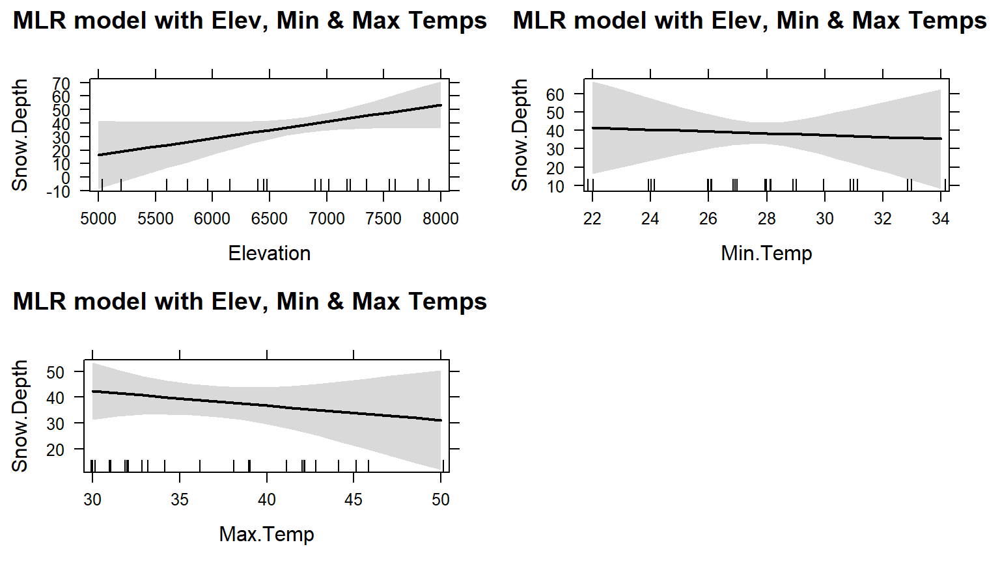
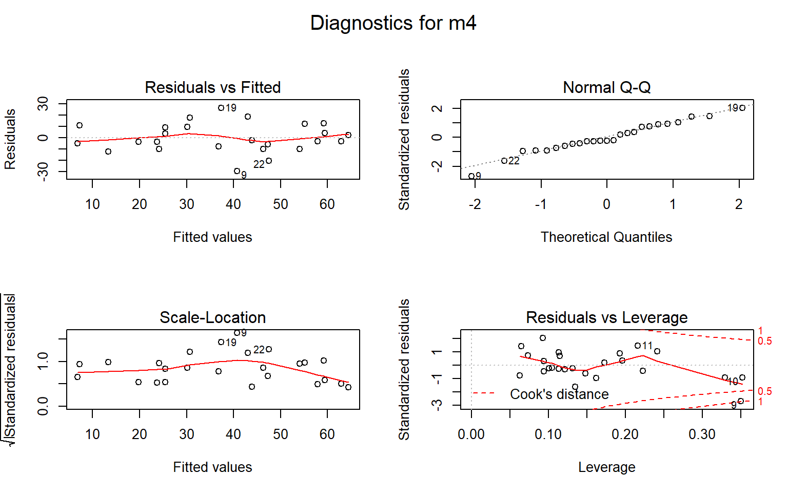
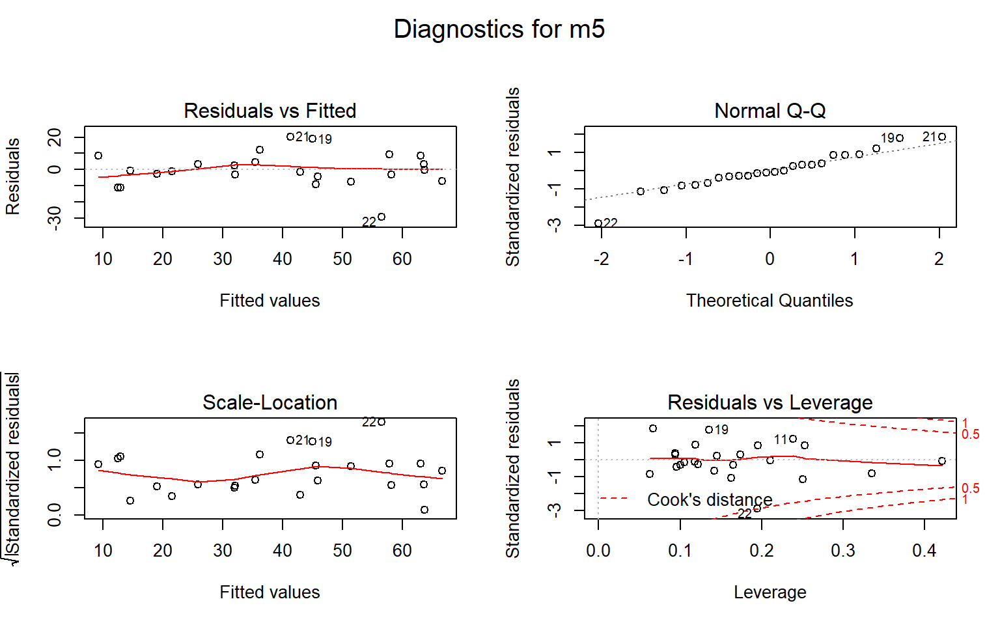
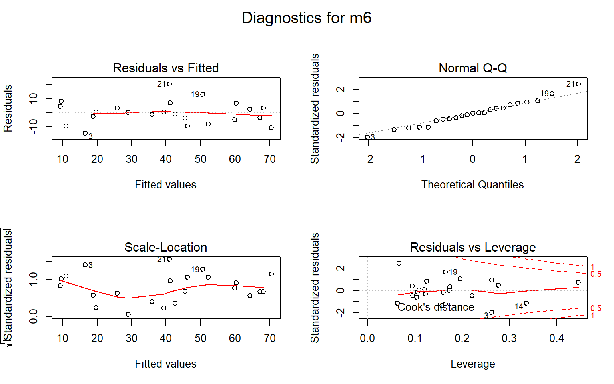
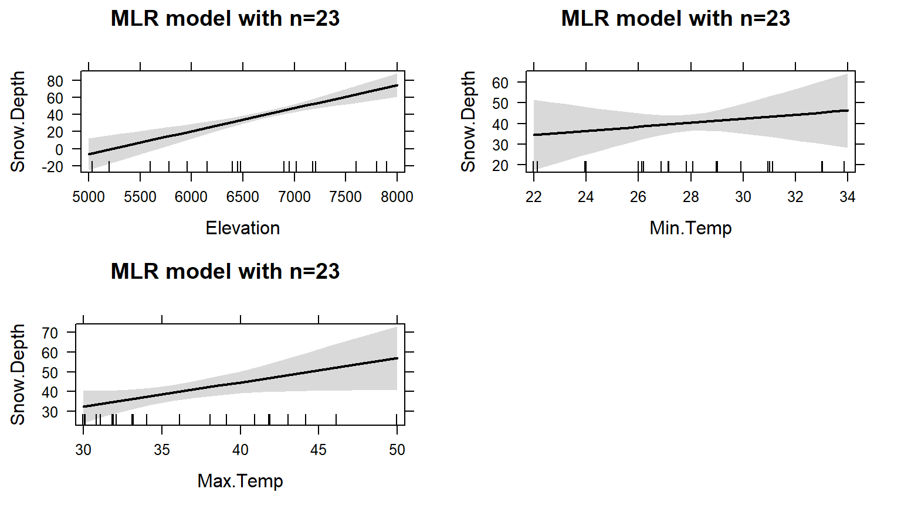

---
output:
  pdf_document: 
    keep_tex: yes
  html_document: default
header-includes:
- \usepackage{amsmath}
- \usepackage{color}
---

# Multiple linear regression {#chapter8}


## Going from SLR to MLR {#section8-1}

In many situations, especially in observational studies, it is unlikely that
the system is simple enough to be characterized
by a single predictor variable. In experiments, if we randomly assign levels of
a predictor variable we can assume that the impacts of other variables cancel
out as a direct result of the random assignment. But it is possible even in
these experimental situations that we can "improve" our model for the response
variable by adding additional predictor variables that explain additional
variation in the responses, reducing the amount of unexplained variation. This
can allow more precise inferences to be generated from the model. As mentioned
previously, it might be useful to know the sex or weight of the subjects in the
Beers vs BAC study to account for more of the variation in the responses -- this
idea motivates our final topic: ***multiple linear regression*** (**MLR**)
models. In observational studies, 
we can think of a suite of characteristics of observations that might be
related to a response variable. For example, consider a study of yearly
salaries and variables that might explain the amount people get paid. We might
be most interested in seeing how incomes change based on age, but it would be
hard to ignore potential differences based on sex and education level. Trying
to explain incomes would likely require more than one predictor variable and we
wouldn't be able to explain all the variability in the responses just based on
gender and education level, but a model using those variables might still
provide some useful information about each component and about age impacts on
income after we adjust (control for) sex and education. The extension to MLR
allows us to incorporate multiple predictors into a regression model.
Geometrically, this is a way of relating many different dimensions (number of
$x\text{'s}$) to what happened in a single response variable (one dimension). 

We start with the same model as in SLR except now we allow $K$ different
$x\text{'s}$:

$$y_i = \beta_0 + \beta_1x_{1i} + \beta_2x_{2i}+ \ldots + \beta_Kx_{Ki}
+ \varepsilon_i$$

Note that if $K=1$, we are back to SLR. In the MLR model, there are $K$
predictors and we still have a
y-intercept. The MLR model carries the same assumptions as an SLR model with a
couple of slight tweaks specific to MLR (see Section \@ref(section8-2)
for the details on the changes to the validity conditions). 

We are able to use the
least squares criterion for estimating the regression coefficients in MLR, but
the mathematics are beyond the scope of this course. The ``lm`` function takes
care of finding the least squares coefficients using a very sophisticated
algorithm^[If you take advanced applied mathematics courses, you can learn
more about the algorithms being used by ``lm``. Everyone else only cares 
about the algorithms when they don't work -- which is usually due to the
user's inputs in these models not the algorithm itself.]. The estimated 
regression equation it returns is:

$$\hat{y}_i = b_0 + b_1x_{1i} +b_2x_{2i}+\ldots+b_Kx_{Ki}$$

where each $b_k$ estimates its corresponding parameter $\beta_k$.

An example of snow depths at some high elevation locations on a day in 
April provides a nice motivation for these methods. A random sample of 
$n=25$ MT locations (from the population of $N=85$ at the time) were obtained 
from the Natural Resources Conversation Service's website 
(http://www.wcc.nrcs.usda.gov/snotel/Montana/montana.html) a few years ago.
Information on the snow depth (``Snow.Depth``) in inches, daily Minimum and
Maximum Temperatures (``Min.Temp`` and ``Max.Temp``) in $^\circ F$ and 
elevation of the site (``Elevation``) in feet. A snow science researcher (or
spring back-country skier) might be interested in understanding *Snow depth* 
as a function of *Minimum Temperature*, *Maximum Temperature*, and *Elevation*.
One might assume that colder
and higher places will have more snow, but using just one of the predictor
variables might leave out some important predictive information. The following
code loads the data set and makes the scatterplot matrix 
(Figure \@ref(fig:Figure8-1)) to allow
some preliminary assessment of the pairwise relationships. 

(ref:fig8-1) Scatterplot matrix of the SNOTEL data.


```r
snotel_s <- read.csv("http://www.math.montana.edu/courses/s217/documents/snotel_s.csv")
snotel2 <- snotel_s[,c(1:2,4:6,3)] #Reorders columns for nicer pairs.panel display
require(psych)
pairs.panels(snotel2[,-c(1:2)], ellipse=F,
             main="Scatterplot matrix of SNOTEL Data")
```

<div class="figure">

<p class="caption">(\#fig:Figure8-1)(ref:fig8-1)</p>
</div>

It appears that there are many strong linear relationships between the variables,
with *Elevation* and *Snow Depth* having the largest magnitude, ***r*** = 0.80.
Higher temperatures seem to be associated with less snow - not a big surprise so
far! There might be an outlier at an elevation of 7400 feet and a snow depth
below 10 inches that we should explore further. 

A new issue arises in attempting to build MLR models called  ***multicollinearity***. Again, it is a not surprise that temperature and
elevation are correlated but that creates a
problem if we try to put them both into a model to explain snow depth. Is it
the elevation, temperature, or the combination of both that matters for getting
and retaining more snow? **Correlation between predictor variables** is called
multicollinearity and **makes estimation and interpretation of MLR models more
complicated than in SLR**. Section \@ref(section8-5) deals with this issue
directly and discusses methods
for detecting its presence. For now, remember that in MLR this issue sometimes
makes it difficult to disentangle the impacts of different predictor variables
on the response when the predictors share information -- when they are
correlated. 

To get familiar with this example, we can start with fitting some potential SLR
models and plotting the estimated models. Figure \@ref(fig:Figure8-2) contains
the result for the SLR using *Elevation* and results for two temperature based
models are in Figure \@ref(fig:Figure8-3). *Snow Depth* is selected as the
obvious response variable both due to skier interest and potential scientific
causation (snow can't change elevation but elevation could be the driver of
snow deposition and retention). 

(ref:fig8-2) Plot of estimated
SLR model for Snow Depth with Elevation as the predictor.

<div class="figure">

<p class="caption">(\#fig:Figure8-2)(ref:fig8-2)</p>
</div>

Based on the model summaries provided below, the three estimated SLR models 
are:

$$\begin{array}{rl}
\widehat{\text{SnowDepth}}_i &= -72.006 + 0.0163\text{ Elevation}_i, \\
\widehat{\text{SnowDepth}}_i &= 174.096 - 4.884\text{ MinTemp}_i,\text{ and} \\
\widehat{\text{SnowDepth}}_i &= 122.672 - 2.284\text{ MaxTemp}_i.
\end{array}$$

The plots of the estimated models reinforce
our expected results, showing a positive change in *Snow Depth* for higher
*Elevations* and negative impacts for increasing temperatures on *Snow Depth*.
These plots are made across the observed range^[Sometimes the effects plots 
ignores the edge explanatory observations with the
default display. Always check the original variable summaries when considering
the range of observed values. The code modifications used to make these plots
are a little annoying and can be avoided if you remember to check the original
summary statistics or scatterplots for variable extrema.] of the predictor 
variable and help us to get a sense of the total impacts of
predictors. For example, for elevation in Figure \@ref(fig:Figure8-2), the 
smallest observed
value was 4925 feet and the largest was 8300 feet. The regression line goes
from estimating a mean snow depth of 8 inches to 63 inches. That gives you some
practical idea of the size of the estimated *Snow Depth* change for the changes in
*Elevation* observed in the data. Putting this together, we can say that
there was around a
55 inch change in predicted snow depths for a close to 3400 foot increase in
elevation. This helps make the slope coefficient of 0.0163 in the model more 
easily understood. Remember that in SLR, the range of $x$ matters just as much 
as the units of $x$ in determining the practical importance and size of the slope
coefficient. A value of 0.0163 looks small but is actually at the heart of a
pretty good model for predicting snow depth. A one foot change of elevation is
"tiny" here relative to changes in the response so the slope coefficient can be
small and still amount to big changes in the predicted response across the range
of values of $x$. If the *Elevation* had been recorded in thousands of feet,
then the slope would have been $0.0163*1000=16.3$ inches in change in mean
*Snow Depth* for a 1000 foot increase in elevation. 

The plots of the two estimated temperature models in 
Figure \@ref(fig:Figure8-3) suggest a similar change in the responses over
the range of observed temperatures. Those predictors range from 22$^\circ F$
to 34$^\circ F$ (minimum temperature) and from 26$^\circ F$ to 50$^\circ F$
(maximum temperature). This tells us a 1$^\circ F$ increase in either 
temperature is a
greater proportion of the observed range of each predictor than a 1 unit (foot)
increase in elevation, so these two variables will generate larger apparent
magnitudes of slope coefficients. But having large slope coefficients is no
guarantee of a good model -- in fact, the elevation model has the highest 
$R^2$ value of these three models even though its slope coefficient looks tiny
compared to the other models.

(ref:fig8-3) Plots of two estimated SLR models using Min Temp (top panel)
and Max Temp (bottom panel) as predictors. Note that each of these results 
are from models with a single predictor variable.

<div class="figure">

<p class="caption">(\#fig:Figure8-3)(ref:fig8-3)</p>
</div>


```r
m1 <- lm(Snow.Depth~Elevation, data=snotel2)
m2 <- lm(Snow.Depth~Min.Temp, data=snotel2)
m3 <- lm(Snow.Depth~Max.Temp, data=snotel2)
require(effects)
plot(allEffects(m1, xlevels=list(Elevation=snotel2$Elevation)),
     main="SLR: Effect of Elevation")
plot(allEffects(m2, xlevels=list(Min.temp=snotel2$Min.Temp)),
     main="SLR: Effect of Min Temp")
plot(allEffects(m3, xlevels=list(Max.Temp=snotel2$Max.Temp)),
     main="SLR: Effect of Max Temp")
```


```r
summary(m1)
```

```
## 
## Call:
## lm(formula = Snow.Depth ~ Elevation, data = snotel2)
## 
## Residuals:
##     Min      1Q  Median      3Q     Max 
## -36.416  -5.135  -1.767   7.645  23.508 
## 
## Coefficients:
##               Estimate Std. Error t value Pr(>|t|)
## (Intercept) -72.005873  17.712927  -4.065 0.000478
## Elevation     0.016275   0.002579   6.311 1.93e-06
## 
## Residual standard error: 13.27 on 23 degrees of freedom
## Multiple R-squared:  0.634,	Adjusted R-squared:  0.618 
## F-statistic: 39.83 on 1 and 23 DF,  p-value: 1.933e-06
```

```r
summary(m2)
```

```
## 
## Call:
## lm(formula = Snow.Depth ~ Min.Temp, data = snotel2)
## 
## Residuals:
##     Min      1Q  Median      3Q     Max 
## -26.156 -11.238   2.810   9.846  26.444 
## 
## Coefficients:
##             Estimate Std. Error t value Pr(>|t|)
## (Intercept) 174.0963    25.5628   6.811 6.04e-07
## Min.Temp     -4.8836     0.9148  -5.339 2.02e-05
## 
## Residual standard error: 14.65 on 23 degrees of freedom
## Multiple R-squared:  0.5534,	Adjusted R-squared:  0.534 
## F-statistic:  28.5 on 1 and 23 DF,  p-value: 2.022e-05
```

```r
summary(m3)
```

```
## 
## Call:
## lm(formula = Snow.Depth ~ Max.Temp, data = snotel2)
## 
## Residuals:
##     Min      1Q  Median      3Q     Max 
## -26.447 -10.367  -4.394  10.042  34.774 
## 
## Coefficients:
##             Estimate Std. Error t value Pr(>|t|)
## (Intercept) 122.6723    19.6380   6.247 2.25e-06
## Max.Temp     -2.2840     0.5257  -4.345 0.000238
## 
## Residual standard error: 16.25 on 23 degrees of freedom
## Multiple R-squared:  0.4508,	Adjusted R-squared:  0.4269 
## F-statistic: 18.88 on 1 and 23 DF,  p-value: 0.0002385
```
 
Since all three variables look like they are potentially useful in predicting
snow depth, we want to consider if an MLR model might explain more of the
variability in *Snow Depth*. To fit an MLR model, we use the same general format
as in other topics but with adding "``+``" between any additional 
predictors^[We used this same notation in the fitting the additive Two-Way 
ANOVA and this is also additive in terms of these variables. Interaction 
models are discussed later in the chapter.] we want to add to the model, 
``y~x1+x2+...+xk``:

(ref:fig8-4) Term-plots for the MLR for Snow Depth based on Elevation, 
Min Temp and Max Temp. Note that the x-axis ranges are different than those 
used in Figures \@ref(fig:Figure8-2) and \@ref(fig:Figure8-3) for the
comparably SLR models. 


```r
m4 <- lm(Snow.Depth~Elevation+Min.Temp+Max.Temp, data=snotel2)
summary(m4)
```

```
## 
## Call:
## lm(formula = Snow.Depth ~ Elevation + Min.Temp + Max.Temp, data = snotel2)
## 
## Residuals:
##     Min      1Q  Median      3Q     Max 
## -29.508  -7.679  -3.139   9.627  26.394 
## 
## Coefficients:
##               Estimate Std. Error t value Pr(>|t|)
## (Intercept) -10.506529  99.616286  -0.105   0.9170
## Elevation     0.012332   0.006536   1.887   0.0731
## Min.Temp     -0.504970   2.042614  -0.247   0.8071
## Max.Temp     -0.561892   0.673219  -0.835   0.4133
## 
## Residual standard error: 13.6 on 21 degrees of freedom
## Multiple R-squared:  0.6485,	Adjusted R-squared:  0.5983 
## F-statistic: 12.91 on 3 and 21 DF,  p-value: 5.328e-05
```

```r
plot(allEffects(m4), main="MLR model with Elev, Min & Max Temps")
```

<div class="figure">

<p class="caption">(\#fig:Figure8-4)(ref:fig8-4)</p>
</div>

Based on the output, the estimated MLR model is

$$\widehat{\text{SnowDepth}}_i = -10.51 + 0.0123\text{ Elevation}_i
-0.505\text{ MinTemp}_i - 0.562\text{ MaxTemp}_i.$$

The direction of the estimated slope coefficients were similar but they 
all changed in magnitude as compared to the respective SLRs, as seen in the
estimated term-plots from the MLR model in Figure \@ref(fig:Figure8-4). 

There are two ways to think about the changes from individual SLR slope
coefficients to the similar MLR results. 

1. Each term in the MLR is the result for estimating each
slope after controlling for the other two variables (and we will always
use this interpretation any time we interpret MLR effects). For example, 
"corrected for" or "adjusted for" the variability that is explained by the
temperature variables. 

2. Because of multicollinearity in the predictors, the
variables might share information that is useful for explaining the
variability in the response variable, so the slope coefficients of each
predictor get perturbed because the model cannot separate their effects on
the response. This issue disappears when the predictors are uncorrelated
or even just minimally correlated. 

There are some ramifications of multicollinearity in MLR:

1. Adding variables to a model might lead to almost no improvement in the
overall variability explained by the model. 

2. Adding variables to a model can cause slope coefficients to change signs
as well as magnitudes. 

3. Adding variables to a model can lead to inflated standard errors for some
or all of the coefficients (this is less obvious
but is related to the shared information in predictors making it less
clear what slope coefficient to use for each variable). 

4. In extreme cases of multicollinearity, it may even be impossible to obtain
any coefficient estimates. 

These seem like pretty serious issues and they are but there are many, many
situations where we proceed with MLR even
in the presence of potentially correlated predictors. It is likely that you
have heard or read about inferences from models that are dealing with this
issue -- for example, medical studies often report the increased risk of death
from some behavior or trait after controlling for sex, age, etc. In many
research articles, it is becoming common practice to report the slope for a
variable most of interest with it in the model alone (SLR) and in models after
adjusting for the other variables that are expected to matter. These types of
results are built with MLR or related multiple-predictor models like MLR. 

## Validity conditions in MLR	{#section8-2}

But before we get to oexcited about any results, we should always assess our
validity conditions. For MLR, they are similar to those for SLR:

* **Quantitative variables condition:**

    * The response and all predictors need to be quantitative variables. 
    This condition is relaxed to allow a categorical predictor in two ways 
    in Sections \@ref(section8-9) and \@ref(section8-11). 

* **Independence of observations:**

    * This assumption is about the responses -- we must assume that they were
    collected in a fashion so that they can be assumed to be independent. This
    implies that we also have independent random errors.
    
    * This is not an assumption about the predictor variables!
    
* **Linearity of relationship (**<b><font color='red'>NEW VERSION FOR MLR!</font></b>**):**

    * Linearity is assumed between the response variable and **each**
    explanatory variable ($y$ and each $x$).
    
    * We can check this two ways:
    
        1. Make plots of the response versus each explanatory variable:
        
            * Only visual evidence of a curving relationship is a problem here.
            Transformations of individual explanatory variables or the
            response are possible.
            
        2. Examine the Residuals vs Fitted plot:
        
            * When using MLR, curves in the residuals vs. fitted values
            suggest a missed curving relationship with at least one predictor
            variable, but it will not be specific as to which one is non-linear.
            Revisit the scatterplots to identify the source of the issue.
            
* **Multicollinearity effects checked for:**

    * Issues here do not mean we cannot proceed with a given model, but it can
    impact our ability to trust and interpret the estimated terms.
    
    * Check a scatterplot or correlation matrix to assess the potential for 
    shared information in different predictor variables.
    
    * Use the diagnostic measure called a ***variance inflation factor***
    (***VIF***) discussed in Section \@ref(section8-5) (we need to develop
    some ideas first to understand this measure).
    
* **Equal (constant) variance:**

    * Same as before since it pertains to the residuals.
    
* **Normality of residuals:**

    * Same as before since it pertains to the residuals.
    
* **No influential points:**

    * Leverage is now determined by how unusual a point is for multiple
    explanatory variables.
    
    * The ***leverage*** values in the Residuals vs Leverage plot are
    scaled to add up to the *degrees of freedom (df) used for the model*
    which is the number of explanatory variables ($K$) plus 1, so $K+1$.
    
    * The scale of leverages depends on the complexity of the model through
    the *df* and the sample size.
    
    * The interpretation is still that the larger the leverage value, the 
    more leverage the point has.
    
    * The mean leverage is always *(model used df)/n = (K+1)/n* -- so focus
    on the values with above average leverage.
    
        * For example, with $K=3$ and $n=20$, the average leverage is
        $4/20=1/5$.
    
    * High leverage points whose response does not follow the pattern defined
    by the other observations (now based on patterns for multiple $x\text{'s}$
    with the response) will be influential.
    
    * Use the Residual's vs Leverage plot to identify problematic points.
    Explore further with Cook's D continuing to provide a measure of the 
    influence of each observation.
    
        * The rules and interpretations for Cook's D are the same as in SLR
        (over 0.5 is possibly influential and over is definitely influential).

While not a condition for use of the methods, a note about RA and RS is useful
here in considering the scope of inference of any results. To make inferences
about a population, we need to have a representative sample. If we have 
randomly assigned levels of treatment variables(s), then we can make causal
inferences to subjects like those that we could have observed. And if we both
have a representative sample and randomization, we can make causal inferences
for the population. It is possible to randomly assign levels of variable(s) to
subjects and still collect additional information from other explanatory
(sometimes called ***control***) variables. The causal interpretations would
only be associated with the explanatory variables that were randomly assigned
even though the model might
contain other variables. Their interpretation still involves noting all the
variables included in the model, as demonstrated below. It is even possible to
include interactions between randomly assigned variables and other variables --
like drug dosage and sex of the subjects. In these cases, causal inference
could apply to the treatment levels but noting that the impacts differ based on
the non-randomly assigned variable. 

For the *Snow Depth* data, the conditions can be assessed as:

* **Quantitative variables condition:**

    * These are all met.

* **Independence of observations:**

    * The observations are based on a random sample of sites from the 
    population and the sites are spread around the mountains in Montana. Many
    people would find it to be reasonable to assume that the sites are 
    independent of one another but others would be worried that sites closer
    together in space might be more similar than they are to far-away 
    observations (this is called ***spatial correlation***). I (Greenwood) have
    been in a heated discussion with statistics colleagues about whether
    spatial dependency should be considered or if it is valid to ignore it in
    this sort of situation. It is certainly possible to be concerned about
    independence of observations here but it takes more advanced statistical
    methods to actually assess whether there is spatial dependency in these data
    and even in those models, the first task would be to fit this sort of model
    and then explore the results. 
    
We need our diagnostic plots to assess the remaining assumptions. The same code
as before will provide diagnostic plots. There is some extra code 
(``par(...)``) added to allow us to add labels to the plots to know which model
is being displayed since we have so many to discuss here.

(ref:fig8-5) Diagnostic plots for model m4: 
$\text{Snow.Depth}\sim \text{Elevation} + \text{Min.Temp} + \text{Max.Temp}$


```r
par(mfrow=c(2,2), oma=c(0,0,2,0))
plot(m4, sub.caption="Diagnostics for m4")
```

<div class="figure">

<p class="caption">(\#fig:Figure8-5)(ref:fig8-5)</p>
</div>

* **Linearity of relationship (**<b><font color='red'>NEW VERSION FOR MLR!</font></b>**):**

    * Make plots of the response versus each explanatory variable:
    
        * In Figure \@ref(fig:Figure8-1), the plots of each variable versus 
        snow depth do not clearly show any nonlinearity except for a little 
        dip around 7000 feet in the plot vs *Elevation*. 
    
    * Examine the Residuals vs Fitted plot in Figure \@ref(fig:Figure8-5):
        
        * Generally, there is no clear curvature in the Residuals vs Fitted
        panel and that would be an acceptable answer. However, there is some
        pattern in the smoothing line that could suggest a more complicated
        relationship between at least one predictor and the response. This also
        resembles the pattern in the *Elevation* vs. *Snow depth* panel in 
        Figure \@ref(fig:Figure8-1) so that might be the source of this 
        "problem". This suggests that there is the potential to do a little 
        bit better but that it is not unreasonable to proceed on with the MLR,
        ignoring this little wiggle in the diagnostic plot.

* **Multicollinearity effects checked for:**

    * The predictors certainly share information in this application 
    (correlations between -0.67 and -0.91) and multicollinearity looks to be 
    a major concern in being able to understand/separate the impacts of
    temperatures and elevations on snow depths.
    
    * See Section \@ref(section8-5) for more on this issue in these data. 
    
* **Equal (constant) variance:**

    * While there is a little bit more variability in the middle of the fitted
    values, this is more an artifact of having a smaller data set with a couple
    of moderate outliers that fell in the same range of fitted values and maybe
    a little bit of missed curvature. So there is not too much of an issue with
    this condition. 
    
* **Normality of residuals:**

    * The residuals are quite good in the QQ-plot, showing only a little 
    deviation for observation 9 from a normal distribution and that deviation 
    is extremely minor. Certainly no evidence of a violation of the normality
    assumption here. 
    
* **No influential points:**

    * With $K=3$ predictors and $n=25$ observations, the average
    leverage is $4/25=0.16$. This gives us a scale to interpret the leverage
    values on the x-axis of the lower right panel of our diagnostic plots.
    
    * There are three higher leverage points (leverages over 0.3) with only
    one being influential (point 9) with Cook's D close to 1.
    
        * Note that point 10 had the same leverage but was not influential with
        Cook's D less than 0.5.
        
    * We can explore both of these points to see how two observations can have
    the same leverage and different amounts of influence. 

The two flagged points, observations 9 and 10 in the data set, are for the
sites "Northeast Entrance" (to Yellowstone) and "Combination". We can use the 
MLR equation to do some prediction for each observation and calculate residuals
to see how far the model's predictions are from the actual observed values for
these sites. For the Northeast Entrance, the *Max.Temp* was 45, the *Min.Temp*
was 28, and the *Elevation* was 7350 as you can see in
this printout of just the two rows of the data set available by referencing
rows 9 and 10 in the bracket from ``snotel2``:


```r
snotel2[c(9,10),]
```

```
##    ID             Station Max.Temp Min.Temp Elevation Snow.Depth
## 9  18 Northeast Entrance        45       28      7350       11.2
## 10 53        Combination        36       28      5600       14.0
```

The estimated *Snow Depth* for the *Northeast Entrance* site (observation 9)
is found using the estimated model with

$$\begin{array}{rl}
\widehat{\text{SnowDepth}}_9 &= -10.51 + 0.0123\text{Elevation}_9 -
0.505\text{MinTemp}_9 - 0.562\text{MaxTemp}_9 \\
& = -10.51 + 0.0123*\boldsymbol{7350} -0.505*\boldsymbol{28} - 
0.562*\boldsymbol{45} \\
& = 40.465 \text{ inches,}
\end{array}$$

but the observed snow depth was actually $y_9=11.2$ inches. The observed  ***residual*** is then

$$e_9=y_9-\hat{y}_9 = 11.2-40.465 = -29.265 \text{ inches.}$$

So the model "misses" the snow depth by over 29 inches with the model suggesting
over 40 inches of snow but only 11 inches actually being present^[Imagine
showing up to a ski area expecting a 40 inch base and there only being
11 inches. I'm sure ski areas are always more accurate than this model in their
reporting of amounts of snow on the ground...]. 


```r
-10.51 + 0.0123*7350 - 0.505*28 - 0.562*45
```

```
## [1] 40.465
```

```r
11.2 - 40.465
```

```
## [1] -29.265
```

This point is being rated as influential (Cook's D $\approx$ 1) with a leverage
of nearly 0.35 and a standardized residual (y-axis of Residuals vs. Leverage
plot) of nearly -3. This suggests that even
with this observation impacting/distorting the slope coefficients (that is what
***influence*** means), the model is still doing really poorly at fitting this
observation. We'll drop it and re-fit the model in a second to see how the slopes
change. First, let's compare that result to what happened for data point 10
("Combination") which was just as high leverage but not identified as
influential. 

The estimated snow depth for "Combination" is </span>

$$\begin{array}{rl}
\widehat{\text{SnowDepth}}_{10} &= -10.51 + 0.0123\text{Elevation}_{10} -
0.505\text{MinTemp}_{10} - 0.562\text{MaxTemp}_{10} \\
& = -10.51 + 0.0123*\boldsymbol{5600} -0.505*\boldsymbol{28} - 
0.562*\boldsymbol{36} \\
& = 23.998 \text{ inches,}
\end{array}$$

The observed snow depth here was $y_{10} = 14.0$ inches so the observed
residual is then

$$e_{10}=y_{10}-\hat{y}_{10} = 14.0-23.998 = -9.998 \text{ inches.}$$

This results in a standardized residual of around -1. This is still a "miss"
but not as glaring as the previous result and also is not having a major impact
on the model's estimated slope coefficients based on the small Cook's D value.


```r
-10.51 + 0.0123*5600 - 0.505*28 - 0.562*36
```

```
## [1] 23.998
```

```r
14 - 23.998
```

```
## [1] -9.998
```

Note that any predictions using this model presume that it is trustworthy, but
the large Cook's D on one observation suggests we should consider the model
after removing that observation. We can re-run the model without the 
9<sup>th</sup> observation using the data set ``snotel2[-9,]``. 

(ref:fig8-6) Term-plots for the MLR for Snow Depth based on Elevation, 
Min Temp, and Max Temp with Northeast entrance observation removed from 
data set (n=24).


```r
m5 <- lm(Snow.Depth~Elevation+Min.Temp+Max.Temp, data=snotel2[-9,])
summary(m5)
```

```
## 
## Call:
## lm(formula = Snow.Depth ~ Elevation + Min.Temp + Max.Temp, data = snotel2[-9, 
##     ])
## 
## Residuals:
##      Min       1Q   Median       3Q      Max 
## -29.2918  -4.9757  -0.9146   5.4292  20.4260 
## 
## Coefficients:
##               Estimate Std. Error t value Pr(>|t|)
## (Intercept) -1.424e+02  9.210e+01  -1.546  0.13773
## Elevation    2.141e-02  6.101e-03   3.509  0.00221
## Min.Temp     6.722e-01  1.733e+00   0.388  0.70217
## Max.Temp     5.078e-01  6.486e-01   0.783  0.44283
## 
## Residual standard error: 11.29 on 20 degrees of freedom
## Multiple R-squared:  0.7522,	Adjusted R-squared:  0.715 
## F-statistic: 20.24 on 3 and 20 DF,  p-value: 2.843e-06
```

```r
plot(allEffects(m5), main="MLR model with NE Ent. Removed")
```

<div class="figure">

<p class="caption">(\#fig:Figure8-6)(ref:fig8-6)</p>
</div>

The estimated MLR model with $n=24$ after removing the influential 
"NE Entrance" observation is

$$\widehat{\text{SnowDepth}}_i = -142.4 + 0.0214\text{ Elevation}_i
+0.672\text{ MinTemp}_i +0.508\text{ MaxTemp}_i.$$

Something unusual has happened here: there is a positive slope for both
temperature terms in Figure \@ref(fig:Figure8-6) that both
contradicts reasonable expectations (warmer temperatures are related to higher
snow levels?) and our original SLR results. So what happened? First, removing
the influential point has drastically changed the slope coefficients (remember
that was the definition of an influential point). Second, when there are
predictors that share information, the results can be somewhat unexpected for
some or all the predictors when they are all in the model together. Note that
the *Elevation* term looks like what we might expect and seems to have a big
impact on the predicted *Snow Depths*. So when the temperature variables
are included in the model they might be functioning to explain some differences
in sites that the *Elevation* term could not explain. This is where our
"adjusting for" terminology comes into play. The unusual-looking slopes for
the temperature effects can be explained
by interpreting them as the estimated change in the response for changes in
temperature **after we control for the impacts of elevation**. Suppose that
*Elevation* explains most of the variation in *Snow Depth* except for a few
sites where the elevation cannot explain all the variability and the site
characteristics happen to show higher temperatures and more snow (or lower
temperatures and less snow). This could be because warmer areas might have been
hit by a recent snow storm while colder areas might have been missed (this is
just one day and subject to spatial and temporal fluctuations in precipitation
patterns). Or maybe there is another factor related to having marginally warmer
temperatures that are accompanied by more snow (maybe the lower snow sites for
each elevation were so steep that they couldn't hold much snow but were also
relatively colder?). Thinking about it this way, the temperature model
components could provide useful corrections to what *Elevation* is providing in
an overall model and explain more variability than any of the variables could
alone. It is also possible that the
temperature variables are not needed in a model with *Elevation* in it, are just
"explaining noise", and should be removed from the model. Each of the next
sections take on various aspects of these
issues and eventually lead to a general set of modeling and model selection
recommendations to help you work in situations as complicated as this. 
Exploring the results for this model assumes we trust it and, once again, we
need to check diagnostics before getting too focused on any particular results
from it. 

The Residuals vs. Leverage diagnostic plot in Figure \@ref(fig:Figure8-7) for
the model fit to the data set without NE Entrance (now $n=24$) reveals a new 
point that is somewhat influential (point 22 in the data set has Cook's D 
$\approx$ 0.5). It is for a location called "Bloody
$\require{color}\colorbox{black}{Redact.}$"^[The site name is redacted to protect
the innocence of the reader. More information on this site, located in
Beaverhead County, is available at
http://www.wcc.nrcs.usda.gov/nwcc/site?sitenum=355&amp;state=mt.] which has a
leverage of nearly 0.2 and a standardized residual of nearly -3. 
This point did not show up as influential in the original version of the data
set with the same model but it is now. It also shows up as a potential outlier. 
As we did before, we can explore it a bit by comparing the model predicted snow
depth to the observed snow depth. The predicted snow depth for this site is

$$\widehat{\text{SnowDepth}}_{22} = -142.4 + 0.0214*\boldsymbol{7550}
+0.672*\boldsymbol{26} +0.508*\boldsymbol{39} = 56.45 \text{ inches.}$$

The observed snow depth was 27.2 inches, so the estimated residual is -39.25
inches. Again, this point is potentially influential and an outlier.
Additionally, our model contains results that are not what we would have
expected *a priori*, so it is not unreasonable to consider removing this
observation to be able to work towards a model that fully trustworthy. 


(ref:fig8-7) Diagnostic plots for MLR for Snow Depth based on Elevation, 
Min Temp and Max Temp with Northeast entrance observation removed from
data set.


```r
par(mfrow=c(2,2), oma=c(0,0,2,0))
plot(m5, sub.caption="Diagnostics for m5")
```

<div class="figure">

<p class="caption">(\#fig:Figure8-7)(ref:fig8-7)</p>
</div>


This worry-some observation is located in the 22<sup>nd</sup> row of the
original data set:


```r
snotel2[22,]
```

```
##    ID           Station Max.Temp Min.Temp Elevation Snow.Depth
## 22 36 Bloody [Redact.]        39       26      7550       27.2
```

With the removal of both the "Northeast Entrance" and "Bloody
$\require{color}\colorbox{black}{Redact.}$" sites, there are $n=23$ observations
remaining. This model (``m6``) seems to contain residual diagnostics (Figure
\@ref(fig:Figure8-8)) that are finally generally reasonable. 

(ref:fig8-8) Diagnostic plots for MLR for Snow Depth based on Elevation, 
Min Temp and Max Temp with two observations removed ($n=23$). 


```r
m6 <- lm(Snow.Depth~Elevation+Min.Temp+Max.Temp, data=snotel2[-c(9,22),])
summary(m6)
```

```
## 
## Call:
## lm(formula = Snow.Depth ~ Elevation + Min.Temp + Max.Temp, data = snotel2[-c(9, 
##     22), ])
## 
## Residuals:
##     Min      1Q  Median      3Q     Max 
## -14.878  -4.486   0.024   3.996  20.728 
## 
## Coefficients:
##               Estimate Std. Error t value Pr(>|t|)
## (Intercept) -2.133e+02  7.458e+01  -2.859   0.0100
## Elevation    2.686e-02  4.997e-03   5.374 3.47e-05
## Min.Temp     9.843e-01  1.359e+00   0.724   0.4776
## Max.Temp     1.243e+00  5.452e-01   2.280   0.0343
## 
## Residual standard error: 8.832 on 19 degrees of freedom
## Multiple R-squared:  0.8535,	Adjusted R-squared:  0.8304 
## F-statistic:  36.9 on 3 and 19 DF,  p-value: 4.003e-08
```

```r
par(mfrow=c(2,2), oma=c(0,0,2,0))
plot(m6, sub.caption="Diagnostics for m6")
```

<div class="figure">

<p class="caption">(\#fig:Figure8-8)(ref:fig8-8)</p>
</div>

It is hard to suggest that there any curvature issues and the slight variation
in the Scale-Location plot is mostly
due to few observations with fitted values around 30 happening to be well
approximated by the model. The normality assumption is generally reasonable and
no points seem to be overly influential on this model (finally!). 

The term-plots (Figure \@ref(fig:Figure8-9)) show that the temperature slopes
are both positive although in this model *Max.Temp* seems to be more
"important" than *Min.Temp*. We have ruled out individual
influential points as the source of un-expected directions in slope coefficients
and the more likely issue is multicollinearity -- in a model that
includes *Elevation*, the temperature
effects may be positive, again acting with the *Elevation* term to generate
the best possible predictions of the
observed responses. Throughout this discussion, we have mainly focused on the
slope coefficients and diagnostics. We have other tools in MLR to more
quantitatively assess and compare different regression models that are considered
in the next sections. 

(ref:fig8-9) Term-plots for the MLR for Snow Depth based on Elevation,
Min Temp and Max Temp with two observations removed.


```r
plot(allEffects(m6), main="MLR model with n=23")
```

<div class="figure">

<p class="caption">(\#fig:Figure8-9)(ref:fig8-9)</p>
</div>

## Interpretation of MLR terms	{#section8-3}

Since these results (finally) do not contain any highly influential points,
we can formally discuss
interpretations of the slope coefficients and how the term-plots 
(Figure \@ref(fig:Figure8-9)) aid
our interpretations. Term-plots in MLR are constructed by holding all the other
variables at their mean and generating predictions and 95% CIs for the mean
response across the levels of observed values for each predictor variable. This
idea also helps us to work towards interpretations of each term in an MLR
model. For example, for *Elevation*, 
the term-plot starts at an elevation around 5000 feet and ends at an elevation
around 8000 feet. To generate that line and CIs for the mean snow depth at
different elevations, the MLR model of

$$\widehat{\text{SnowDepth}}_i = -213.3 + 0.0269\text{ Elevation}_i
+0.984\text{ MinTemp}_i +1.243\text{ MaxTemp}_i$$

is used, but we need to have "something" to put in for the two temperature
variables to predict *Snow Depth* for different *Elevations*. The typical
convention is to hold the "other" variables at their means to
generate these plots. This tactic also provides a way of interpreting each
slope coefficient. Specifically, we can interpret the *Elevation* slope as:
For a 1 foot increase in *Elevation*, we expect the mean *Snow Depth* to
increase by 0.0269 inches, holding the minimum and maximum temperatures
constant. More generally, the ***slope interpretation in an MLR*** is:

* For a 1 ***[units of $\boldsymbol{x_k}$]*** increase in 
$\boldsymbol{x_k}$, we expect the mean of $\boldsymbol{y}$ to change by
$\boldsymbol{b_k}$ ***[units of y]***, after controlling for
**[list of other explanatory variables in model]**. 

To make this more concrete, we can recreate some points in the Elevation
term-plot. To do this, we first need the mean of the "other" predictors, 
*Min.Temp* and *Max.Temp*. 


```r
mean(snotel2[-c(9,22),]$Min.Temp)
```

```
## [1] 27.82609
```

```r
mean(snotel2[-c(9,22),]$Max.Temp)
```

```
## [1] 36.3913
```

We can put these values into the MLR equation and simplify the equation, to
an equation that is just in terms of
just *Elevation* given that we are holding *Min.Temp* and *Max.Temp* at their
means:

$$\begin{array}{rl}
\widehat{\text{SnowDepth}}_i &= -213.3 + 0.0269\text{ Elevation}_i
+0.984*\boldsymbol{27.826} +1.243*\boldsymbol{36.391} \\
&= -213.3 + 0.0269\text{ Elevation}_i + 27.38 + 45.23 \\
&= \boldsymbol{-140.69 + 0.0269}\textbf{ Elevation}_\boldsymbol{i}.
\end{array}$$

So at the means on the two temperature variables, 
the model looks like an SLR with an estimated y-intercept of -140.69 (mean 
*Snow Depth* for *Elevation* of 0 if temperatures are at their means) 
and an estimated
slope of 0.0269. Then we can plot the predicted changes in $y$ across all the
values of the predictor variable (*Elevation*) while holding the other
variables constant. To generate the needed values to define a line, we can plug
various *Elevation* values into the simplified equation:

* For an elevation of 5000 at the average temperatures, we predict a mean snow
depth of $-140.69 + 0.0269*5000 = -6.19$ inches.

* For an elevation of 6000 at the average temperatures, we predict a mean snow
depth of $-140.69 + 0.0269*6000 = 20.71$ inches.

* For an elevation of 8000 at the average temperatures, we predict a mean snow
depth of $-140.69 + 0.0269*8000 = 74.51$ inches.

We can plot this information (Figure \@ref(fig:Figure8-10)) using the ``plot``
function to show the points we calculated and the ``lines`` function to add 
a line that connects the dots. In the ``plot`` function, we used the
``ylim=...`` option to make the scaling on the y-axis match the previous
term-plot's scaling.

(ref:fig8-10) Term-plot for Elevation "by-hand", holding temperature 
variables constant at their means. 


```r
par(mfrow=c(1,1))
#Making own effect plot:
elevs <- c(5000,6000,8000)
snowdepths <- c(-6.19,20.71,74.51)
plot(snowdepths~elevs, ylim=c(-20,90), cex=2, col="blue", pch=16,
     main="Effect plot of elevation by hand")
lines(snowdepths~elevs, col="red", lwd=2)
```

<div class="figure">

<p class="caption">(\#fig:Figure8-10)(ref:fig8-10)</p>
</div>

Note that we only needed 2 points to
define the line but need a denser grid of elevations if we want to add the 95%
CIs for the true mean snow depth across the different elevations since they
vary as a function of the distance from the mean of the explanatory variables. 

To get the associated 95% CIs, we could return to using the ``predict``
function for the MLR, again holding the temperatures at their
mean values. The ``predict`` function is sensitive and needs the same variable
names as used in the original model fitting to work. First we create a "new"
data set using the ``seq`` function to generate the desired grid of
elevations and the ``rep`` function^[The ``seq`` function has syntax of
``seq(from=startingpoint, to=endingpoint,
length.out=#ofvalues_between_start_and_end)`` and the ``rep`` function has
syntax of ``rep(numbertorepeat, #oftimes).``] to repeat the means of the
temperatures for each of elevation values we need to make the plot. The code
creates a specific version of the predictor variables to force the ``predict``
function to provide fitted values and CIs across different elevations with
temperatures held constant that is stored in ``newdata1``. 


```r
elevs <- seq(from=5000, to=8000, length.out=30)
newdata1 <- data.frame(Elevation=elevs, Min.Temp=rep(27.826,30),
                       Max.Temp=rep(36.3913,30))
newdata1
```

```
##    Elevation Min.Temp Max.Temp
## 1   5000.000   27.826  36.3913
## 2   5103.448   27.826  36.3913
## 3   5206.897   27.826  36.3913
## 4   5310.345   27.826  36.3913
## 5   5413.793   27.826  36.3913
## 6   5517.241   27.826  36.3913
## 7   5620.690   27.826  36.3913
## 8   5724.138   27.826  36.3913
## 9   5827.586   27.826  36.3913
## 10  5931.034   27.826  36.3913
## 11  6034.483   27.826  36.3913
## 12  6137.931   27.826  36.3913
## 13  6241.379   27.826  36.3913
## 14  6344.828   27.826  36.3913
## 15  6448.276   27.826  36.3913
## 16  6551.724   27.826  36.3913
## 17  6655.172   27.826  36.3913
## 18  6758.621   27.826  36.3913
## 19  6862.069   27.826  36.3913
## 20  6965.517   27.826  36.3913
## 21  7068.966   27.826  36.3913
## 22  7172.414   27.826  36.3913
## 23  7275.862   27.826  36.3913
## 24  7379.310   27.826  36.3913
## 25  7482.759   27.826  36.3913
## 26  7586.207   27.826  36.3913
## 27  7689.655   27.826  36.3913
## 28  7793.103   27.826  36.3913
## 29  7896.552   27.826  36.3913
## 30  8000.000   27.826  36.3913
```

The predicted snow depths along with 95% confidence intervals for the mean,
holding temperatures at their means, are:


```r
predict(m6, newdata=newdata1, interval="confidence")
```

```
##           fit        lwr      upr
## 1  -6.3680312 -24.913607 12.17754
## 2  -3.5898846 -21.078518 13.89875
## 3  -0.8117379 -17.246692 15.62322
## 4   1.9664088 -13.418801 17.35162
## 5   4.7445555  -9.595708 19.08482
## 6   7.5227022  -5.778543 20.82395
## 7  10.3008489  -1.968814 22.57051
## 8  13.0789956   1.831433 24.32656
## 9  15.8571423   5.619359 26.09493
## 10 18.6352890   9.390924 27.87965
## 11 21.4134357  13.140233 29.68664
## 12 24.1915824  16.858439 31.52473
## 13 26.9697291  20.531902 33.40756
## 14 29.7478758  24.139153 35.35660
## 15 32.5260225  27.646326 37.40572
## 16 35.3041692  31.002236 39.60610
## 17 38.0823159  34.139812 42.02482
## 18 40.8604626  36.997617 44.72331
## 19 43.6386092  39.559231 47.71799
## 20 46.4167559  41.866745 50.96677
## 21 49.1949026  43.988619 54.40119
## 22 51.9730493  45.985587 57.96051
## 23 54.7511960  47.900244 61.60215
## 24 57.5293427  49.759987 65.29870
## 25 60.3074894  51.582137 69.03284
## 26 63.0856361  53.377796 72.79348
## 27 65.8637828  55.154251 76.57331
## 28 68.6419295  56.916422 80.36744
## 29 71.4200762  58.667725 84.17243
## 30 74.1982229  60.410585 87.98586
```

So we could do this with any model **for each predictor** variable to create
term-plots, or we can just use the ``allEffects`` function to do this for us.
This exercise is useful to complete once to understand what is being displayed
in term-plots but using the ``allEffects`` function makes getting these plots
much easier. 

There are two other model components of possible interest in this model. The 
slope of 0.984 for *Min.Temp* suggests that for a 1$^\circ F$ increase in 
*Minimum Temperature*, we expect a 0.984 inch change in the mean *Snow Depth*,
after controlling for *Elevation* and *Max.Temp* at the sites. Similarly, the
slope of 1.243 for the *Max.Temp* suggests that for a 1$^\circ F$ increase in
*Maximum Temperature*, we expect a 1.243 inch change in the mean *Snow Depth*,
holding *Elevation* and *Min.Temp*constant. Note that there are a variety of ways
to note that each term in an
MLR is only a particular value given the other variables in the model. We can
use words such as "holding the other variables constant" or "after adjusting
for the other variables" or "controlling for the other variables". The main
point is to find words that reflect that this single slope coefficient might be
different if we had a different overall model and the only way to interpret it
is conditional on the other model components. 

Term-plots have a few general uses to enhance our regular slope interpretations.
They can help us the model predicts over the range of each observed $x$. This can
help you to get a sense of the "practical" importance of each term. 
Additionally, the term-plots show 95% confidence intervals for the mean response
across the range of each variable, 
holding the other variables at their means. These intervals can be useful for
assessing the precision in the estimated mean at different values of each
predictor. However, note that you should not use these plots for deciding
whether the term should be retained in the model -- we have other tools for
making that assessment. And one last note about term-plots -- they do not mean
that the relationships are really linear between the predictor and response
variable being displayed. The model **forces** the relationship to be linear
even if that is not the real functional form. **Term-plots are not diagnostics
for the model, they are summaries of the model you assumed was correct!**
Any time we do linear regression, all of our inferences are contingent upon the
model we chose. We know our model is not
perfect, but we hope that it helps us learn something about our research
question(s). 

## Comparing multiple regression models	{#section8-4}

## General recommendations for MLR interpretations and VIFs	{#section8-5}

## MLR Inference: Parameter inferences using the t-distribution	{#section8-6}

## Overall F-test in Multiple Linear Regression	{#section8-7}

## Case Study: First year college GPA and SATs	{#section8-8}

## Different intercepts for different groups: MLR with Indicator variables	{#section8-9}

## Additive MLR with more than two groups: Headache example	{#section8-10}

## Different slopes and different intercepts	{#section8-11}

## F-tests for MLR models with quantitative and categorical variables and interactions	{#section8-12}

## AICs for model selection	{#section8-13}

## Forced Expiratory Volume model selection using AICs	{#section8-14}

## Chapter summary	{#section8-15}

## Important R code	{#section8-16}

## Practice problems	{#section8-17}
