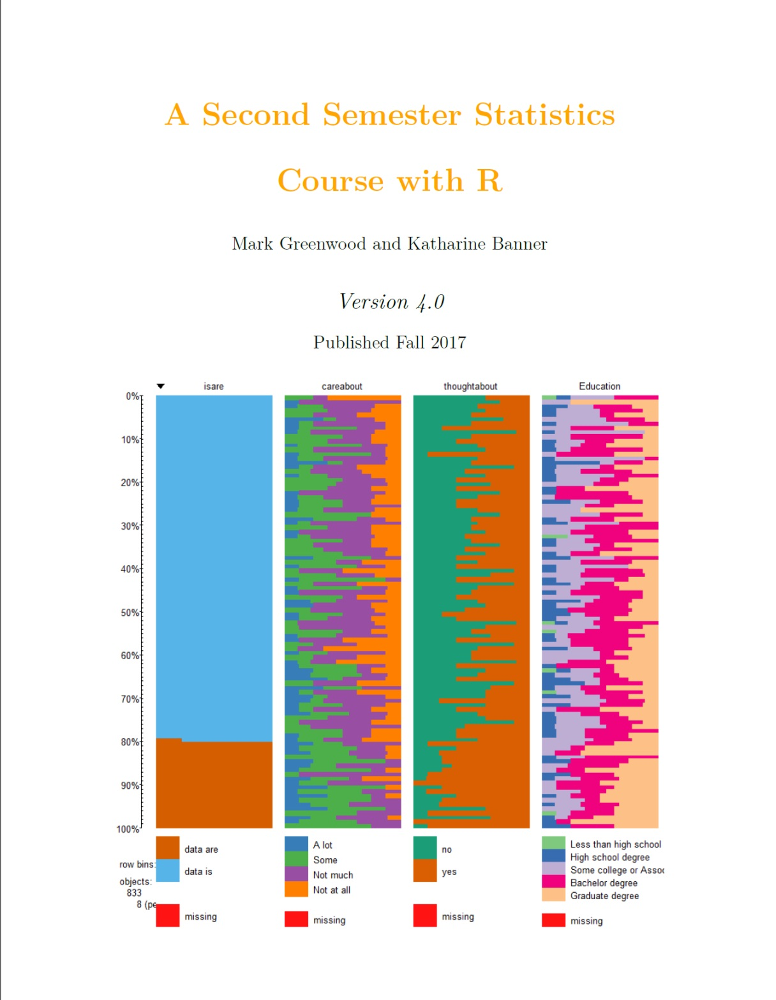

--- 
title: "A Second Semester Statistics Course with R"
author: "Mark Greenwood and Katharine Banner"
date: 'Version 4.0 -- Published Fall 2017'
output:
  bookdown::pdf_book: 
    keep_tex: yes
    latex_engine: pdflatex
  bookdown::html_book:
    css: toc.css
    toc: yes
    mathjax: default
  bookdown::gitbook: default
documentclass: book
link-citations: yes
github-repo: gpeterson406/GreenwoodBanner_Book
bibliography:
- references.bib
- packages.bib
site: bookdown::bookdown_site
biblio-style: apalike
header-includes:
- \usepackage{amsmath}
- \usepackage{color}
---

# Cover {-}

<!-- -->

# Acknowledgments {-}

We would like to thank all the students and instructors who have provided input in the development of the current version of STAT 217 and that have impacted the choice of topics and how we try to teach them. Dr. Robison-Cox initially developed this course using R and much of this work retains his initial ideas. Many years of teaching these topics and helping researchers use these topics has helped to refine how they are presented here. Observing students years after the course has also helped to refine what we try to teach in the course, trying to prepare these students for the next levels of statistics courses that they might encounter and the next class where they might need or want to use statistics.

I (Greenwood) have intentionally taken a first person perspective at times to be able to include stories from some of those interactions to try to help you avoid some of their pitfalls in your current or future usage of statistics. I would like to thank my wife, Teresa Greenwood, for allowing me the time and support to work on this. I would also like to acknowledge Dr. Gordon Bril (Luther College) who introduced me to statistics while I was an undergraduate and Dr. Snehalata Huzurbazar (University of Wyoming) that guided me to completing my Master’s and Ph.D. in Statistics and still serves as a valued mentor and friend to me.

The development of this text was initially supported with funding from Montana State University’s Instructional Innovation Grant Program with a grant titled Towards more active learning in STAT 217. This book was born with the goal of having a targeted presentation of topics that we cover (and few that we don’t) that minimizes cost to students and incorporates the statistical software R from day one and every day after that. The software is a free, open-source platform and so is dynamically changing over time. This has necessitated frequent revisions of the text. 

This is Version 3.01 of the book. It fixes a problem created with the digital links in the book that occurred during Spring 2017. Version 3.0 of the book, prepared for Fall 2016, involved edits, a couple of partially new sections, and updated R code along with a new format for how the R code is displayed to more easily distinguish it from other text. Each revision has involved a similar amount of change with Version 2.0 published in January 2015 and Version 1.0 in January 2014 after using draft chapters that were initially developed during Fall 2013.

We have made every attempt to keep costs as low as possible by making it possible for most pages to be printed in black and white. The text (in full color and with dynamic links) is also available as a free digital download from Montana State University’s ScholarWorks repository at https://scholarworks.montana.edu/xmlui/handle/1/2999. 

Enjoy your journey from introductory to intermediate statistics!
 

This work is licensed under the Creative Commons Attribution-NonCommercial-NoDerivatives 4.0 International License. To view a copy of this license, visit http://creativecommons.org/licenses/by-nc-nd/4.0/ or send a letter to Creative Commons, 444 Castro Street, Suite 900, Mountain View, California, 94041, USA.

